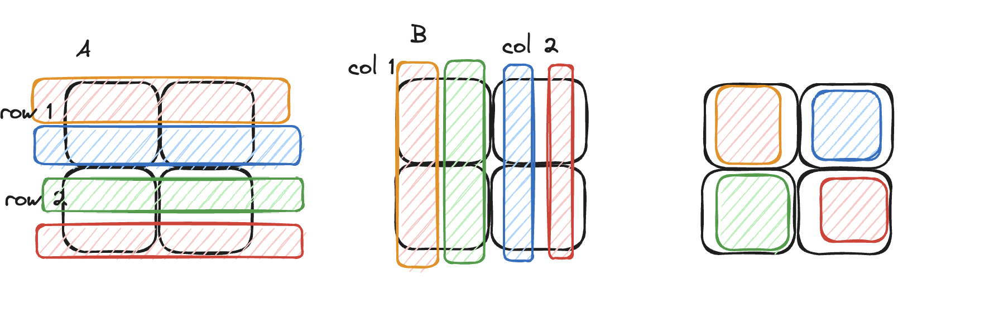
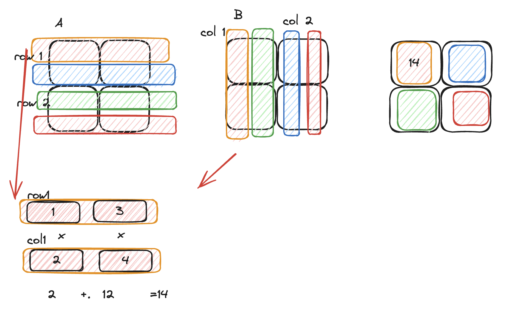
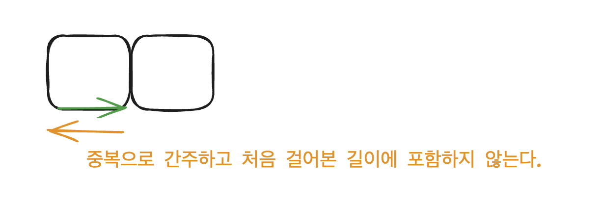

### 2D Array 다루기 

이 글은 골든래빗 코딩 테스트 합격자 되기 파이썬 편의 5장 써머리입니다.

- 2차원 배열은 1차원 배열을 확장한 것이다. 1차원 배열을 확장했다는 것은 2차원 배열도 1차원공간에 저장하고 **메모리에 연속**적으로 할당했다고 볼 수 있다. 
- 즉 차원과는 무관하게 연속적으로 할당된다. 
- 배열을 다룰 땐 할당할 수 있는 메모리의 크기를 확인하는게 좋은데, 2차원 배열의 경우 **3000*3000** 크기를 최대로 생각한다. (운영체제에 따라 다르기도하다.) (1차원은 최대 1000만개)
- 차원에 상관없이 배열에서 데이터 삽입이 배열의 마지막이 아닌 중간에 삽입해야 한다면, 삽입한 인덱스 부터  오른쪽으로 인덱스들을 한칸씩 뒤로 밀려줘야 하므로 시간복잡도에서 시간초과를 고려하는게 좋다.


### 2D array 문제 다뤄보기

### 1. 행렬의 곱셈 

출처 : https://school.programmers.co.kr/learn/courses/30/lessons/12949

**문제 설명**
    
2차원 행렬 arr1과 arr2를 입력받아, arr1에 arr2를 곱한 결과를 반환하는 함수, solution을 완성해주세요.
    
제한 조건
    
 - 행렬 arr1, arr2의 행과 열의 길이는 2 이상 100 이하입니다.
 - 행렬 arr1, arr2의 원소는 -10 이상 20 이하인 자연수입니다.
 - 곱할 수 있는 배열만 주어집니다.
    
입출력 예
    
 | arr1 | arr2 | return |
 | --- | --- | --- |
 | [[1, 4], [3, 2], [4, 1]] | [[3, 3], [3, 3]] | [[15, 15], [15, 15], [15, 15]] |
| [[2, 3, 2], [4, 2, 4], [3, 1, 4]] | [[5, 4, 3], [2, 4, 1], [3, 1, 1]] | [[22, 22, 11], [36, 28,18], [29, 20, 14]] |

**문제 풀이**

- 이 문제의 핵심은 행렬의 곱셈 공식을 알아야 한다.




- 두행렬을 곱하려면 이런 규칙을 따라야 한다.
    1. 행렬 A의 행과 행렬 B의 열의 길이는 같아야 합니다.
    2. 결과 행렬의 크기는 행렬 A의 행의 수와 행렬 B의 열의 수가 됩니다.
        

**방법1. 내가 푼 방법** :
        
    - 하나의 row를 가졌다면, 내부 for문을 이용해  다른 2차원 배열의 column을 아예 가져와 서로 계산하는 방법이다.



```javascript

function solution(arr1, arr2) {
  // arr1의 row, arr2의 col 길이로 answer 배열 만들기
  let answer = Array.from({ length: arr1.length }, () =>
    Array(arr2[0].length).fill(0)
  );
  // arr1의 row, arr2의 col 길이만큼 반복문 돌리기
  for (let row = 0; row < arr1.length; row++) {
    for (let col = 0; col < arr2[0].length; col++) {
      let rowArr = arr1[row];
      let colArr = getCols(arr2, col); //col 이 일치하는 arr2의 열을 가져옴.
      answer[row][col] = calculate(rowArr, colArr);
    }
  }
  return answer;
}

function calculate(row, col) {
  let sum = 0;
  for (let i = 0; i < row.length; i++) {
    sum += row[i] * col[i];
  }
  return sum;
}

function getCols(arr, col) {
  let result = [];
  for (let i = 0; i < arr.length; i++) {
    for (let j = 0; j < arr[0].length; j++) {
      if (j === col) {
        result.push(arr[i][j]);
      }
    }
  }
  return result;
}

```

**시간복잡도 분석 :**

1. **`answer`** 배열 생성:
- **`answer`** 배열은 **`n x m`** 크기의 2차원 배열을 생성하므로 시간 복잡도는 O(nm) 이다.
2. 이중 반복문:
    `for (let row = 0; row < arr1.length; row++)`와 `for (let col = 0; col < arr2[0].length; col++)` 이중 반복문을 사용하여 각 원소를 계산.
    - `arr1` 의 행의 수를  `n` 이라고 하고, `arr2` 의 열의 수를  `m` 이라고 할 때, 이중 반복문의 시간 복잡도는 O(nm).
3. `getCols` 함수:
    `getCols` 함수는 `arr2`에서 특정 column의 값을 가져오기 위해 사용.
    `arr2`의 행의 수를 `n`이라고 하고, `arr2`의 열의 수를 `m`이라고 할 때, `getCols` 함수의 시간 복잡도는 O(nm).
4. `calculate` 함수:
    `calculate` 함수는 row, col 이 만났을 때 계산을 한다. O(n) 의 시간복잡도를 가진다. 

**총 시간 복잡도는 O(n*m*k)**


**방법2.**

row1 과 계산될 col1을 가져오는게 아닌, for문 내에서 바로 O(n)계산. 위와 문제 해결 접근은 같지만, 코드 표현만 다르다.
여기서의 `k` 는 행과 열이 만나 각자 대응하여 계산하게 될 횟수를 나타낸다.
시간복잡도는 3중 for문으로  이 방법도 첫번째 방법과 동일하게 `O(n*m*k)` 시간복잡도이다. 이를 좀 더 정확하게 보자면, 
사실 k는 row 길이 col길이와도 동등하다고 볼 수 있으므로 `O(k^3)` 의 시간복잡도를 가진다. (=방법1도 마찬가지이다)


```javascript
function solution(arr1, arr2){
    let rows=arr1.length;
    let cols = arr2[0].length;      

    let result = Array.from({length: rows},()=> Array.from({length: cols},()=> 0))  

    for(let row=0; row<rows; row++){
        for(let col=0; col<cols; col++){
            for(let k=0; k<rows[0].length; k++ ){    
                result[row][col] += arr1[row][k] * arr[k][col]
            }
        }
    }
    return result;
}

```
 


### 2. 방문길이 

출처 : https://school.programmers.co.kr/learn/courses/30/lessons/49994

4가지 명령어를 통해 움직이려 합니다. 명령어는 다음과 같습니다.

- U: 위쪽으로 한 칸 가기
- D: 아래쪽으로 한 칸 가기
- R: 오른쪽으로 한 칸 가기
- L: 왼쪽으로 한 칸 가기

캐릭터는 좌표평면의 (0, 0) 위치에서 시작합니다. 좌표평면의 경계는 왼쪽 위(-5, 5), 왼쪽 아래(-5, -5), 오른쪽 위(5, 5), 오른쪽 아래(5, -5)로 이루어져 있습니다.

캐릭터가 처음 걸어본 길의 길이를 구해야 한다.


**입출력 예**

| dirs | answer |
| --- | --- |
| "ULURRDLLU" | 7 |
| "LULLLLLLU" | 7 |

이 문제는 두가지 핵심포인트가있다.

- 중복 경로 처리 방법
- 좌표의 경계가 -5 부터 5까지의 경계로 이루어져 있다.

- 중복 경로는 두가지 경우가 있다.
1.  a→b, b→a 의 경로인경우 중복으로 간주하고, 처음걸어 본 길이에 포함하지 않는다.
2. a→b, a→b  똑같은 출발점과 똑같은 도착점을 두번이상 간다. 
    


    
- 중복 경로를 처리하기 위해 좋은 자료구조는 **Set** 이다.
- 위 1 번의 경우, 처음 방문했을 때 출발좌표->도착좌표, 도착좌표->출발좌표로 두가지 경우를 모두 set에 넣는다. 그 이유는 다음에 반대방향의 경로가 있다면 이미 set에 있기때문에 중복으로 간주하고 처음 걸어 본 길이에 포함하지 않을 수 있기 때문이다. 
- 위 2 번의 경우, set 함수를 사용하여 애초에 중복된 것을 포함하지 않고 배제한다.

- 좌표의 경계처리
    - 주어진 그림상으로는 (0,0)에서 시작하여  -5와 5사이의 정사각형 범위에서 움직인다.
    - 나같은 경우는 항상 왼쪽상단 끝을 (0,0)으로 시작하는 것에 익숙하여 시작좌표를 애초에 (5,5) 로 둔다.
    - 범위는 (0,10)으로 둔다. (개인적인 생각으로는 x,y좌표를 양수로 두는게 문제 풀 때 실수의 위험을 줄여준다.)
    
**전체적인 문제 접근법**
>
**1.** (5,5) 에서 주어진 명령문을 통해 방향을 설정하고 1칸 움직인다.  
**2.** 이동한 다음 좌표가 주어진 좌표평면의 범위에 유효한지 검사한다.  
**2-1.** 만약 유효하지 않다면, 움직일 필요가 없다.  
**2-2.** 만약 유효하다면, 방문처리를 한다  
**3.** 방문처리를 하기 전, 현재 방문한 곳이 이미 방문했던 경로인지 먼저 확인한다.  
**3-1.** set의 자료구조를 통해 O(1)의 복잡도로 방문처리에 비용을 많이 들이지 않고 확인할 수 있다. 이미 set에 있다면, 더이상 방문처리할 필요가 없다.  
**3-2.** 만약 처음 방문한 곳이라면(set에 없는 경우), (출발 좌표,도착좌표 )(도착좌표,출발좌표)를 추가한다.  
**3.3** 처음 가본 길이에 +1추가한다.  
**4.** 마지막 방향 지시문을 끝내고 나서, 총 방문  한 길이를 리턴한다. 또는 set 에서 이미 한경로에 두가지의 경우를 다 담고 있으니, set의 사이즈에서/2한 값을 리턴하는 방법도 있다.  
>   
      
    
    ```jsx
    function solution(dirs){
    let current = [5, 5];
    let count =0;

      for (const dir of dirs) {
        const index = direction[dir];
    
        const nx = current[0] + dx[index];
        const ny = current[1] + dy[index];
    
        if (nx < 0 || ny < 0 || nx > 10 || ny > 10) continue;
    
        //check if visited
        const visitedX = nx;
        const visitedY = ny;
    
        if (!visited[visitedX][visitedY]) {
          visited[visitedX][visitedY] = `${current[0]}${current[1]}`;
          visited[current[0]][current[1]] = `${visitedX}${visitedY}`;
          count += 1;
          current = [nx, ny];
          continue;
        }
        if (
          visited[visitedX][visitedY].indexOf(`${current[0]}${current[1]}`) !==
            -1 ||
          visited[current[0]][current[1]].indexOf(`${visitedX}${visitedY}`) !== -1
        ) {
          current = [nx, ny];
          continue;
        }
        current = [nx, ny];
    
        count += 1;
      }
      return count;
    }
    ```
    
이 문제의 시간복잡도는 주어진  방향 명령문의 길이 만큼만 순회하므로 O(dirs.length) 가 된다.


### 이번 주 회고 


- 2D array는 프론트에서 구현으로 상당히 많이 쓰이는데 생각보다 쉽게 풀진 못하는 것 같다.(좀 더 연습필요)
- 책의 문제 외에도 스터디에선 leetcode 문제들도 추가적으로 푸는데 생각보다 배열의 문제에서 공간복잡도를 최적화하는 문제들이 흥미로웠다. 
 

