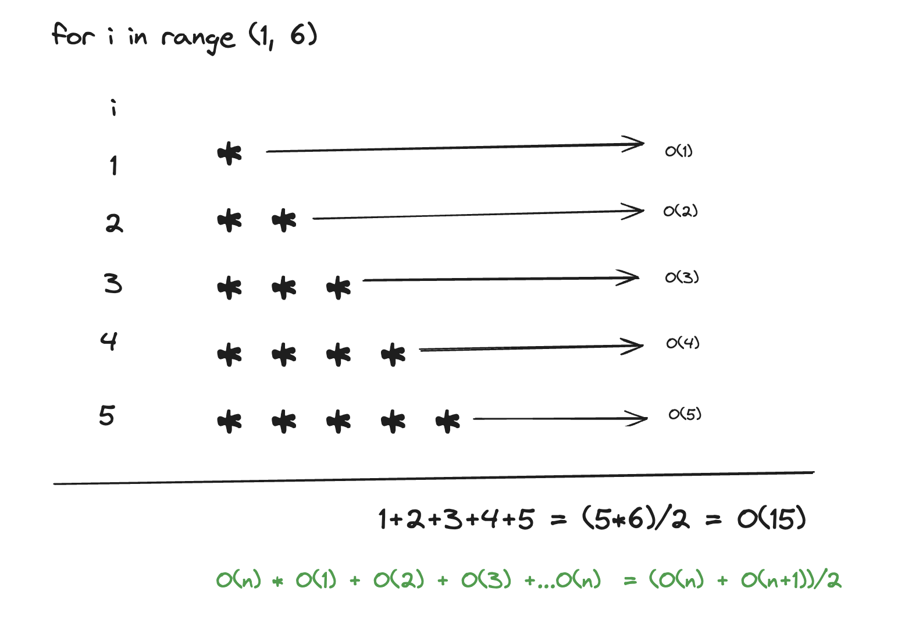
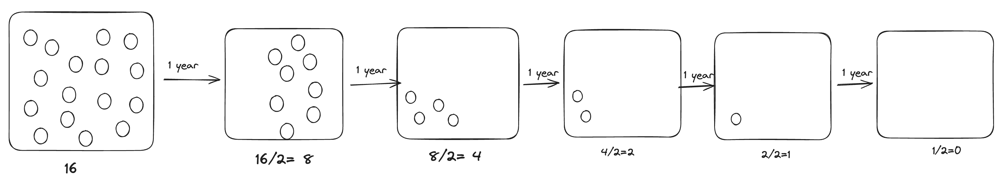

### 들어가며 

- 최근 혼자서 준비하던 알고리즘 공부가 시간 대비 집중이 잘안되고 점점 늘어 지고 있었다. 마침, 알고리즘 스터디원을 모집하는 글이 눈에 들어왔고, 주저 없이 신청하였는데 멤버가 되었다. (아마 문닫고 들어온 멤버가 아닐까 한다)
- 스터디는 최근 출간된 책 `코딩테스트 합격자되기`의 출판사 골든 래빗에서 스터디 장을 모집하여 운영이 되는 듯 했다. 책은 주로 파이썬 언어(JS가 주 언어인 나) 로 이루어져있지만, 언어와 상관없이 스터디 에서 얻을 수 있는 동기부여, 다양한 관점, 피드백을 통한 개선 등 이점이 많을 것이라고 믿고 스터디를 시작하게 되었다.
- 찬찬히 책을 보던 중, p96의 박테리아 소멸시기에서 조건문이 문장의 의도와 조금 다른것 같아 네이버카페에 글을 올렸는데 저자님이 확인하시고 정오표에 올라가는 에피소드도 있었다. 🙂
[코딩테스트 합격자되기 p64.박테리아 소멸시기 수식에 대한 궁금증](https://cafe.naver.com/dremdeveloper/957)
- 이 글은 골든래빗 코딩 테스트 합격자 되기 파이썬 편의 0장 ~ 4장 써머리입니다.

## 코딩테스트 효율적으로 준비하기

- 책에서도 명시 되어 있지만 특정 언어의 중요성을 말하진 않는다. 자신이 가장 잘 할 수 있는 언어가 좋다!.
- 문제 풀이 능력을 확인하기 때문에 문제를 분석하는 연습이 필요하다.
    - 이를 위해 문제를 작은 단위로 나누어서 분석,  입력값 파악, 핵심 키워드에 따른 알고리즘을 선택할 수 있도록 정리.
    - 제약사항을 유심히 파악해야 하고 이를 고려해서 테스트케이스를 추가하는 연습을 하는 것이 좋다.
- 프로그램의 논리를 설명하고 알고리즘을 표현하기 위해 의사코드로 설계하는 연습이 필요하다.
    - 의사코드는 세부구현이 아닌 동작중심으로!
    - 문제 해결 순서로 작성.
    - 충분한 테스트.

## 시간복잡도

- 입력 크기에 따른 연산 횟수의 추이를 활용해서 시간복잡도를 표현하는 방법을 점근적 표기법이라고 하는데 사실 책의 내용으로 이해가 부족하여 리서치 후 정리한 결과는 이렇다.

> **점근 표기법**(漸近 表記法, [영어](https://ko.wikipedia.org/wiki/%EC%98%81%EC%96%B4): asymptotic notation)은 어떤 함수의 증가 양상을 다른 함수와의 비교로 표현하는 [수론](https://ko.wikipedia.org/wiki/%EC%88%98%EB%A1%A0)과 [해석학](https://ko.wikipedia.org/wiki/%ED%95%B4%EC%84%9D%ED%95%99_(%EC%88%98%ED%95%99))의 방법이다. [알고리즘](https://ko.wikipedia.org/wiki/%EC%95%8C%EA%B3%A0%EB%A6%AC%EC%A6%98)의 [복잡도](https://ko.wikipedia.org/wiki/%EB%B3%B5%EC%9E%A1%EB%8F%84_%EC%9D%B4%EB%A1%A0)를 단순화할 때나 [무한급수](https://ko.wikipedia.org/wiki/%EB%AC%B4%ED%95%9C%EA%B8%89%EC%88%98)의 뒷부분을 간소화할 때 쓰인다. -위키백과-
> 

- 이 점근 표기법은 점근적 실행 시간을 이용하는데, 여기서의 점근적 실행 시간이란 주어진 입력값N이 커질 때, 함수의 실행 시간의 추이를 말한다.
- 함수의 실행 시간의 추이란 말은  연산이 빨리 끝날 수도 있고, 늦게 끝날 수도 있다.
- 최선의 경우 (= 가장 빨리 실행 될 때, 연산이 빨리 끝날 때 ) 가 있을 것이고,
- 최악의 경우 (= 가장 늦게 실행될 때, 연산이 늦게 끝날 때) 가 있을 것이고,
- 평균이 있을 것이다.
- 이런 경우 점근표기법의 종류에 따라 표현될 수 있다. 점근 표기법은 (빅오, 빅오메가, 세타 등 ) 이 있다.
- 빅오 표기법은 최선, 최악, 평균의 경우에서 수행시간의 상한을 나타낸다. (가장 늦게 실행 될 때)
- 세타 표기법은 최선, 최악, 평균의 경우에서 수행시간의 하한을 나타낸다. (가장 빨리 실행 될 때)
- 결론은 입력값/데이터의 수가 클 때, 알고리즘의 효율에 따라 수행시간이 차이가 나니 고려해서 문제에 접근해야 한다.

### 시간복잡도 계산들

**예제 1)** 

```python
def solution(n):
	count= 0

for i in range(n):
	for j in range(n):
			count+=1  // O(n^2)

for k in range(n): 
	count+=1 // O(n)

for i in range(2*n):
	count+=1  // O(2n)

for i in range(5):
	count+=1 // O(5) 
```

최악의 경우를 대변하는  최고차항인 O(n^2) 가 시간복잡도이다. 

 

**예제2) N번째 줄까지 병 1개부터 N개까지 늘려가며 출력했을 때 시간복잡도는 ? **

```python
*
* *
* * * 
* * * * 
* * * * * 

```



- 별을 n개의 줄만큼 채우기 위해 순회할 loop이 필요할 것이다.  
- loop에서의 i 가 각 한줄이 될 것이고, 한 줄마다 *을 프린트 해야 하는데, i 개 만큼 프린트 해야 한다. 즉 O(i)번의 연산이 이루어진다. 
- 하드코딩으로 ** 하지 않는 이상 연속된 *을 프린트하기 위해선 연산이 * 개수 만큼 이루어진다. 
- n=5라고 했을 때, 한줄에 i 개 만큼 별을 찍는다면 연산 횟수는 i 번째 줄엔 O(i) 만큼 연산이 이루어 진다. 
- 총 O(1)부터 O(n)까지의 합이 총 연산 횟수가 되고, 이를 가우스 덧셈을 이용한 식으로 나타내면 최고 차항인 O(n<sup>2</sup>)이 된다. 


**예제3) 초기 박테리아  세포 개수가 N =16 일 때, 해마다 세포개수가 이전 세포개수의 반으로 준다면, 모든 박테리아가 죽을 때까지의 시간복잡도는?**





주어진 입력값 n = 16 에서 n≤0 이 되기까지 몇번의 연산을 수행했는지를 알아내는게 목표이다.
위의 이미지와 같이 5년이면 박테리아가 소멸 된다. 

- 1년마다 N이 1/2 만큼 줄어 든다.
- 5년의 경우 아래와 같은 식에서 i= 5가 되면 0 이 된다.  
- 박테리아의 소멸시키는 박테리아의 수가 1보다 작아질 때인데, 이를 수식으로 나타내면 다음과 같다. 
>
<p>
  (<sup>1</sup>/<sub>2</sub>)<sup>i</sup> * N &lt; 1
</p>


- 여기서 i는 연도(년)를 나타내며, (1/2)^i는 연도마다 박테리아 개수가 반감되는 비율을 나타낸다.
- i가 증가할 수록 박테리아 개수 N 은 감소한다. 
- i를 구하는 수식이 곧 복잡도가 된다.  

> i > log<sub>2</sub>(N)

- 어떤 N의 값이 반으로 줄어드는 동작이 있다면, 시간복잡도는 `log(N)` 이라고 간주한다.

