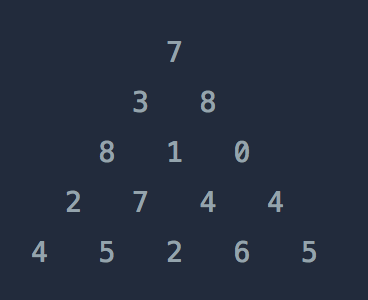

- 골든래빗 코딩 테스트 합격자 되기 파이썬 편의 15장 써머리가 포함되어 있습니다.
- 동적계획법은 모든 문제를 다 풀진 못했다. 어렵기도 했지만, DP의 잘 알려진 연습 문제에 익숙해 지는 것이 목표이다. 

## 동적계획법 문제 조건 
1. 최적 부분 구조(Optimal substructure) 
큰 문제의 해결책은 작은 문제의 해결책의 합으로 구성할 수 있어야 한다.  
구현 방법 : 점화식 세우기 

2. 중복 부분 문제(Overlapping subproblems)
작은 문제들이 같아야 하고 반복되어야 한다. 
구현 방법 : 메모이제이션을 통해 반복되는 작은 문제에 연산 횟수를 줄여 연산 효율화 증대.


## 문제 적용 

### LIS길이 계산하기 
>문제 설명
정수 배열 nums에서 LIS의 길이를 찾는 함수를 작성하세요.
nums의 최대 길이 1,000의 정수 배열 
nums의 각 요소는 -1000 이상 1000이하의 정수 입니다. 
입력 
[1,4,2,3,1,5,7,3], 5
[3,2,1]  1

LIS(Longest Increasing Subsequence) 는 최장 증가 부분 수열로서 주어진 수열에서 만들수 있는 모든 부분 수열에서 가장 긴 증가하는 수열을 구한다. 증가하는 부분 수열을 구할 때 전후 관계를 유지 해야 한다. 

```
1 4 2 3 1 5 7 3 에서 
전후 관계를 유지한 수열 
1 2 3 5
전후 관계를 유지하지 않은 수열 
1 3 2 5 (인덱스의 전 후 순서를 바꾸면 안된다) 
```

이 문제를 brute force로 접근 할 경우, 1로 끝나는 부분수열, 4로 끝나는 부분수열, 2으로 끝나는 부분수열,... 3로 끝나는 부분 수열에서 증가하는 조건을 만족하는 최대 길이를 구하게 될 것 이다.  시간복잡도는 2^1000 이 되므로 연산의 최적화가 필요하다. 
```
1 4 2 3 에서 

[1] 1로 끝나는 LIS길이 
[1,4] 4로 끝나는 LIS길이 
[1,4,2] 2로 끝나는 LIS길이
[1,4,2,3,] 3로 끝나는 LIS길이 

최적 부분 구조 : 각 숫자로 끝나는 LIS길이 중 최대값 (여기서 각 숫자는 가장 작은 길이 1 을 알아야 한다.)

중복 부분 문제 : 2로 끝나는 LIS의 길이를 구할 땐, 4로 끝나는 LIS 길이를 참조한다. 

문제에서 구하고자 하는것 dp[N]: arr[N]이 마지막 숫자로 끝나는 LIS의 길이.
dp의 점화식 은 DP[N] = max(dp[k] )+1 이 되고 여기의 조건은 `arr[k]<arr[N]` 이 된다. 
k: 0~ N-1 ,  N 이전의 숫자를 보는 포인터 

종료 조건 : 
dp[1] =1 //길이가 1일 때, 가장 긴 증가하는 수열의 길이는 1개이다. 
```

```javascript
//시간 복잡도 : O(n^2)
function solution(nums){
    let dp = Array.from({length: nums.length+1}, ()=> 1)

    for (let i=0; i<nums.length; i++){
        for(let j=0; j<i;j++){
            if(nums[i]>nums[j]){
                dp[i] = Math.max(dp[i], dp[j]+1)
            }
        }
    }
    return  Math.max(...dp)
}
```

#### LCS 길이 계산하기 

>문제풀이
주어진 두 개의 문자열 str1과  str2에 대해 최장 공통 부분 수열의 길이를 계산하는  solution() 함수를 구현하세요. 
>
>제약 조건
>- 각 문자열 str1과  str2의 길이는 1 이상 1,000이하 입니다.
>- 문자열은 알파벳 대문자, 소문자로 구성 되어 있습니다. 

LCS(Longest Common Subsequence) 는 두 수열에서 공통으로 발견할 수 있는 가장 긴 부분 수열을 의미한다. 

두 개의 문자열의 인덱스를 하나씩 비교해 봐야 한다. 
```
문제에서 구하고자 하는것
dp[i][j]:  첫 문자열의 인덱스 0~ i번째까지의 문자열과 두번째 문자열 인덱스 0~j번째 까지의 문자열을 비교했을 때,공통 부분 문자열의 최대 길이 


점화식 
dp[i][j] = dp[i-1][j-1]+1  if str1[i] === str2[j]
dp[i][j] = dp[i-1,j][i,j-1] if str1[i] !== str2[j]

dp[0][0] = 0


```

```javascript
// 시간복잡도: O(str1.length*str2.length)


```


### 피보나치 수  [문제 출처: 프로그래머스](https://school.programmers.co.kr/learn/courses/30/lessons/12945?language=javascript)

>**문제 설명**
>피보나치 수는 F(0) = 0, F(1) = 1일 때, 1 이상의 n에 대하여 F(n) = F(n-1) + F(n-2) 가 적용되는 수 입니다.
>
>예를들어
>
>F(2) = F(0) + F(1) = 0 + 1 = 1
>F(3) = F(1) + F(2) = 1 + 1 = 2
>F(4) = F(2) + F(3) = 1 + 2 = 3
>F(5) = F(3) + F(4) = 2 + 3 = 5
>와 같이 이어집니다.
>
>2 이상의 n이 입력되었을 때, n번째 피보나치 수를 >1234567으로 나눈 나머지를 리턴하는 함수, solution을> 완성해 주세요.
>
>제한 사항
>n은 2 이상 100,000 이하인 자연수입니다.
>

입력값이 십만이니 O(n)의 복잡도는 가능하다.

피보나치의 수에서 최적 부분 구조는 F(n)을 구하기 위해  이미 계산 되어진 바로 앞의 두 항의 각 결과 값,F(n-1), F(n-2)이다. 
결과 값들을 구해야 큰 값인 F(n)을 구할 수 있다. 

만약 이 문제를 재귀를 사용하게 된다면,  F(4)=F(3)+F(2) 일 때 F(3) 을 계산시 F(2) +F(1) 에서 F(2)를 중복으로 계산하는 부분을 메모이제이션을 통해 최적화 할 수 있으므로,중복 부분 문제에 해당 된다. 

아래는 메모이제이션을  바텀업 방식을 적용하였다. 

```javascript
function solution(n) {
   
    if(n<2) return 1%1234567
    let a=0, b=1
    let remainder;
    for(let i=2; i<=n; i++){
         remainder = (a+ b)%1234567
         a = b
         b = remainder   
    }
    return b;
}


```
### 2 x n 타일링 [문제출처: 프로그래머스](https://school.programmers.co.kr/learn/courses/30/lessons/12900)

>**문제설명**
문제 설명
가로 길이가 2이고 세로의 길이가 1인 직사각형모양의 타일이 있습니다. 이 직사각형 타일을 이용하여 세로의 길이가 2이고 가로의 길이가 n인 바닥을 가득 채우려고 합니다. 타일을 채울 때는 다음과 같이 2가지 방법이 있습니다.
>
>타일을 가로로 배치 하는 경우
타일을 세로로 배치 하는 경우
예를들어서 n이 7인 직사각형은 다음과 같이 채울 수 있습니다.
>


>직사각형의 가로의 길이 n이 매개변수로 주어질 때, 이 직사각형을 채우는 방법의 수를 return 하는 solution 함수를 완성해주세요.
>
>제한사항
가로의 길이 n은 60,000이하의 자연수 입니다.
경우의 수가 많아 질 수 있으므로, 경우의 수를 1,000,000,007으로 나눈 나머지를 return해주세요.
입출력 예
n	result
4	5
>

이 문제가 DP인 이유는 
1. 최적 부분 구조 

 

n = 3은 n = 1일 때 경우의 수와 n=2일 때 경우의 수를 그대로 이용한다. 
세로길이는 정해져 있고, 주어진 타일의 가로 길이는 1또는 2 이므로 가로 길이가 1일 때와 2일 때 경우의 수가 달라진다. 
그럼 마지막에 올 타일이 가로길이 1인 타일과 2인 타일 두 개로 결정 지어 지므로, n-1 경우의 수 , n-2 경우의 수 합으로 나타낼 수 있다. 
n =3을 풀기 위해선,  n =2 경의의 수와 n=1일때의 가짓수에 의존한다. 
 

2. 중복 부분 문제
점화식으로 나타내면  dp[n] = dp[n-1]+dp[n-2] 가 되고, 
점화식을 재귀 연산을 사용하게 되면, 피보나치수열을 재귀로 표현한 방식 처럼 같은 연산을 반복하는 일이 생기므로 메모이제이션을 사용한다. 
조건에 만족하기 때문이다. 

```javascript
function solution(n) {
   let dp = Array.from({length: n+1},()=>0);

   dp[1] = 1;
   dp[2] = 2;
    
    if(n <= 2 ) return dp[n];
    for(let i=3; i<=n; i++){
        dp[i] = (dp[i-1] + dp[i-2])%1000000007;        
    }
    return dp[n]
}

```

#### 정수 삼각형 (문제출처: 프로그래머스)[]



>위와 같은 삼각형의 꼭대기에서 바닥까지 이어지는 경로 중, 거쳐간 숫자의 합이 가장 큰 경우를 찾아보려고 합니다. 아래 칸으로 이동할 때는 대각선 방향으로 한 칸 오른쪽 또는 왼쪽으로만 이동 가능합니다. 예를 들어 3에서는 그 아래칸의 8 또는 1로만 이동이 가능합니다.
>
>삼각형의 정보가 담긴 배열 triangle이 매개변수로 주어질 때, 거쳐간 숫자의 최댓값을 return 하도록 solution 함수를 완성하세요.
>
>제한사항
삼각형의 높이는 1 이상 500 이하입니다.
삼각형을 이루고 있는 숫자는 0 이상 9,999 이하의 정수입니다.
>

입출력 예
triangle	result
[[7], [3, 8], [8, 1, 0], [2, 7, 4, 4], [4, 5, 2, 6, 5]]	30

문제에서 구하고자 하는 것은 삼각형의 꼭대기에서 바닥까지 거치는 숫자들의 합 중 가장 큰 최대값을 구한다. 

이 문제를 brute force방식으로 풀게 되면 꼭대기 7->3 으로 시작하여 도착하는 모든 경우의 수, 7->8 로 시작하여 도착하는 모든 경우의 수에서 합을 찾아내어 그 중의 최대값을 구하는 방식으로 접근한다, 
하지만, 높이가 500일 때 경우의 수는 높이가 1일 때 경우의 수 1, 높이가 2일 때 경우의 수 2, 높이가 3일 때 경우의 수 4 , 2^(높이) 로 2^500 의 시간복잡도를 가지게 된다. 
이를 통해 DP로 연산을 최적화 해야 한다. 

바닥에 도착했을 때 `[4, 5, 2, 6, 5]` 에 따라 4로 도착하는 경우, 5로 도착하는 경우, 6로 도착하는 경우, 5로 도착하는 경우에서 최대값이 꼭대기부터 바닥까지 거치는 숫자들의 최대값이 된다. 

바닥의 4는 그 위 단계의 합에 의존하게 되므로, 최적 부분 구조에 만족한다. 

그리고 경로에서 도착하는 지점에는 기억해둔 그 위 단계의 합을 가져와 도착지점을 합산한다는 점에서 중복 부분 문제에 포함된다. 

```javascript
function solution(triangle) {
    for (let row = triangle.length - 2; row >= 0; row--) {
        for (let col = 0; col < triangle[row].length; col++) {
            // 아래쪽 행의 인접한 두 숫자 중 더 큰 숫자를 현재 숫자에 더함
            triangle[row][col] += Math.max(triangle[row + 1][col], triangle[row + 1][col + 1]);
        }
    }
    // 최상단에 최댓값이 존재함
    return triangle[0][0];
}

```


