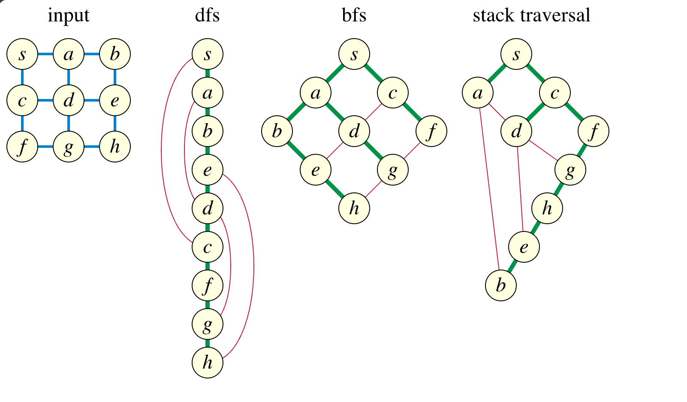

## 그래프 개념

- 그래프는 노드와 간선을 이용한 **비선형 데이터 구조**
- 그래프는 데이터 간의 관계를 표현하는 데 사용.
- 데이터를 노드, 노드간의 관계나 흐름을 간선으로 표현
- 방향성 :방향이 있을 수도 있고 없을 수도 있다.
- 가중치 : 노드간의 관계에서 가중치가 있을 수도 있고, 없을 수도 있다.
- 사이클 : 순환 그래프(Cycle graph)와 비순환 그래프(acyclic graph)로 구분 될 수 있다.

## 그래프 구현 방식

- 인접 행렬과 인접 리스트 방식을 이용하여 그래프 표현

### 인접 행렬

- 단점 : 인접 행렬에서는 어떤 노드에 인접한 노드들을 찾기 위해 인접 리스트에 비해 효율성이 떨어진다. 모든 노드를 순회해야 하기 때문이다.

- 장점 : 간선의 정보를 확인할 때 O(1)시간복잡도로 매우 효율적이다. ex) 2 - 99 노드사이의 가중치를 확인하기 위해 `array[2][99]` 접근.
  인접 리스트 경우 `adj[2]`를 통해 연결된 모든 노드들을 다시 순회하여 `99`를 찾아야 한다.

### 인접 리스트(adjacency list)

- 간선 정보 확인시 특정노드에서 시작하여 연결 노드 개수가 많을 수록, 연결한 노드들의 길이 만큼 탐색해야 하므로 O(N)의 탐색 시간을 가진다.

|             | 메모리사용 | 시간복잡도 | 기타                   |
| ----------- | ---------- | ---------- | ---------------------- |
| 인접 행렬   | O(N^2)     | O(1)       | 구현이 상대적으로 쉬움 |
| 인접 리스트 | O(N^2)     | O(N)       |                        |

- 책에선 노드 개수가 1000개 미만일 경우 시간효율 장점을 활용한 인접 행렬 사용도 제시되어 있다.

## 그래프 탐색

### DFS(깊이우선탐색)

- 스택을 기반으로 깊이 우선 탐색을 구현한다.
- 이 탐색의 전체적 아이디어는 하나의 깊이 (노드)를 들어가면 해결책이 있다고 예상하는 것이다.
- 노드를 방문했을 때 방문 처리를 하고, 방문한 노드의 인접 노드들을 순회하며 방문 하지 않았을 경우 스택에 넣어 미래에 탐색할 노드를 추적한다.

- `a`와 이웃한 노드 `b`를 방문했다면, `a`와 인접한 다른 노드를 방문 하기 전에 `b` 와 인접한 이웃 노드 들을 전부 방문해야 한다. `b`의 분기를 전부 탐색한 뒤에야 `a` 의 다른 이웃 노드를 방문 할 수 있다.
- 이웃 노드를 계속해서 방문할 때 **무한 루프** 방지 하기 위해 현재 방문한 노드 처리가 필요하다.

- 노드의 개수- N, 간선의 개수-E 일 경우,
- 인접 리스트를 생성할 때는 간선 개수만큼 연산하므로 시간 복잡도는 O(E)
- 탐색 시 모든 노드를 1회 방문(중복 처리로 인해 1회 방문 가능) 하므로 N번 순회한다. O(N)
- 각 연산이 따로 이루어지므로 O(E+V)

```javascript
function solution(graph, start) {
  const result = []
  const adjList = {}

  //인접리스트 초기화
  graph.forEach(([from, to]) =>
    adjList[from] ? adjList[from].push(to) : (adjList[from] = [to]),
  )

  dfs(start, new Set()) //set 자료구조를 이용하여 중복 방문처리
  return result

  function dfs(v, visited) {
    visited.add(v) //방문 처리
    result
      .push(v)(
        //인접 노드 탐색
        adjList[v] || [],
      )
      .forEach((w) => (!visited.has(w) ? dfs(w, visited) : null))
  }
}
```

### BFS(너비 우선 탐색)

- `A`노드에서 시작 한다고 했을 때, BFS는 `A`의 이웃 노드(=인접 노드)를 모두 방문 한 다음 이웃의 이웃들을 방문한다.
- 이런 구현을 위해선 자료구조 큐를 이용하여 탐색을 한다.
- 자료구조 큐를 이용했을 때 최단 경로를 보장 할 수 있다.
- 아래의 구현에 의해 방문 경로는 A-B-C-D-E 로 루트로 부터 차수 단계에 있는 모든 노드를 방문 한 것을 확인할 수 있다.-> 최단 경로 보장

```javascript

A
| \
B  C
|   \
D    E

queue = [A]
큐의 가장 앞 대기열 꺼내기
A 방문 , queue = []
방문하지 않은 인접노드 B,C 추가  queue= [B,C]

큐의 가장 앞 대기열 꺼내기
B 방문,  queue =[C]
방문하지 않은 B의 인접 노드 D추가 queue = [C,D]

큐의 가장 앞 대기열 꺼내기
C 방문, queue= [D]
방문하지 않은 C의 인접 노드 E 추가 queue= [D,E]

큐의 가장 앞 대기열 꺼내기
D 방문, queue = [E]
D의 인접 노드 중 방문하지 않은 노드 x , queue=[E]

큐의 가장 앞 대기열 꺼내기
E 방문, queue = []
E의 인접 노드 중 방문하지 않은 노드 x, queue =[]

queue의 원소가 없으면 종료.

```

```javascript
const assert = require('assert')

/**
 * TimeComplexity
 * @param {*} graph
 * @param {*} start
 * @returns
 */
function solution(graph, start) {
  const adjList = {}
  graph.forEach(([from, to]) =>
    adjList[from] ? adjList[from].push(to) : (adjList[from] = [to]),
  )
  const queue = [start]
  const result = [start] //방문한 노드 담는 배열, bfs에서는 queue에 있는 노드는 이미 방문처리 완료.

  bfs(queue)
  return result

  function bfs() {
    while (queue.length) {
      const nextList = adjList[queue.shift()]
      ;(nextList || []).forEach((next) => {
        if (result.includes(next)) return false //이미 방문한 노드면 continue
        result.push(next) //방문처리
        queue.push(next) //방문처리
      })
    }
  }
}

assert.deepEqual(
  solution(
    [
      [1, 2],
      [1, 3],
      [2, 4],
      [2, 5],
      [3, 6],
      [3, 7],
      [4, 8],
      [5, 8],
      [6, 9],
      [7, 9],
    ],
    1,
  ),
  [1, 2, 3, 4, 5, 6, 7, 8, 9],
)

assert.deepEqual(
  solution(
    [
      [0, 1],
      [1, 2],
      [2, 3],
      [3, 4],
      [4, 5],
      [5, 0],
    ],
    1,
  ),
  [1, 2, 3, 4, 5, 0],
)
```

### DFS와 BFS의 interchangeable 한가?

오늘 스터디장님의 질문이 있었는데 DFS와 BFS는 interchangeable 한가 였다.
원리를 제대로 이해하고 있지 못하니 답을 할 수 없었다. 공유해 주신 자료 [Stack-based graph traversal ≠ depth first search](https://11011110.github.io/blog/2013/12/17/stack-based-graph-traversal.html)을 다시 읽어 보았다.
원문의 의도와 제 번역과 다를 수 있습니다. 이 부분에 대해 다른 생각이나 틀린 부분이 있다면 알려주시면 감사하겠습니다.

처음 나의 생각은 BFS의 큐 방식을 스택으로 바꿔 구현하면 스택으로 부터 나온 노드의 인접 노드들 중 방문하지 않은 노드들을 스택에 넣고 다음 순회에서 최근 노드를 가져오기를 반복하면 DFS로 가능하지 않을까가 내 생각이었다.

이 글에선 내 생각이 틀렸음을 반증해준다.
이 코드는 bfs의 queue를 stack으로 변경한 코드 이다. stack으로 변경되었으니 얼핏 dfs가 되지 않을까 하지만 아래 이미지처럼 input이 주어졌을 때, 실제 dfs코드는 s-a-b-e-d-c-f-g-h-e-g 이런 방식으로 가야 하는데,
_stack traversal 함수를 적용하면 dfs도 bfs도 아닌 방식으로 탐색이 된다._

원글에서 트리나 AI research context에서 중복 검사를 하지 않는 경우는 실제 DFS 탐색을 한다고 한다. 하지만 일반적 방문 여부를 가진 그래프에서는 DFS 탐색이 아니라고 한다. 이렇게 되는 이유가 코드에서 처럼 인접 노드를 스택에 먼저 넣다 보니, _DFS에서 말하는 부모-자식의 관계로 끝까지 탐색하는 과정이 이루어 지지 않는다_.

```python
def stack_traversal(G,s):
    visited = {s}
    stack = [s]
    while stack:
        v = stack.pop()
        for w in G[v]:
            if w not in visited:
                visited.add(w)
                stack.append(w)
```



이에 대한 스택을 이용한 방법으로 DFS를 구현하기 위해선, 현재 노드에서 인접 노드를 스택에 넣는 것이 아닌, 인접 노드를 방문 하고 나서 넣는 방식으로 변경 하여 DFS 를 구현한다.

```python
def dfs2(G,s):
    visited = set()
    stack = [s]
    while stack:
        v = stack.pop()
        if v not in visited:
            visited.add(v)
            for w in G[v]:
                stack.append(w)
```

iterator를 이용한 다른 방법도 제시한다.

```python

def dfs(G,s):
    visited = {s}
    stack = [iter(G[s])]
    while stack:
        try:
            w = stack[-1].next()
            if w not in visited:
                visited.add(w)
                stack.append(iter(G[w]))
        except StopIteration:
            stack.pop()

```

위의 두가지 방법은 서로 순회 순서는 다르지만 DFS 구현에 있어선 충분하며, 첫번째 방식이 중복으로 인해 더 많은 공간을 차지 하지만 dfs에선 둘다 유효한 탐색이다.

## 그래프 최단 경로 구하기

### 다익스트라와 벨만-포드 알고리즘 차이

|                     | 목적                                            | 장단점 및 특징                                                                       | 시간 복잡도                           |
| ------------------- | ----------------------------------------------- | ------------------------------------------------------------------------------------ | ------------------------------------- |
| 다익스트라 알고리즘 | 출발 노드로부터 도착 노드들까지의 최단경로 찾기 | 음의 가중치를 가지느 그래프에서 최단 경로를 구할 수 없음(그리디 방식)                | O(V^2), 우선순위큐 의 경우 O(E\*logV) |
| 벨만-포드 알고리즘  | 출발노드로부터 도착 노드들까지의 최단 경로 찾기 | 음의 가중치를 가지는 그래프에서 최단 경로를 구할 수 있고, 음의 순환도 감지할 수 있음 | O(V\*E)                               |

### 다익스트라 구현 방법

1. 거리 테이블 초기화,
2. 경로 테이블 초기화 (문제에 따라 최적화된 경로 출력이 필요할 시)
3. 우선순위큐 초기화
4. 큐내에 원소가 있다면,
5. 가장 짧은 거리의 값을 가지고 있는 원소를 가져온다.
6. 만약 현재 노드의 거리 값이 큐에서 가져온 거리값보다 크면, 해당노드는 이미 처리된 것으로 간주 하고 다음 iteration을 진행한다.
7. 아니라면, 현재 노드와 인접한 노드들의 거리를 계산하여 업데이트

```javascript
const assert = require('assert')
const { PriorityQueue } = require('../utils/PriorityQueue')

function solution(graph, start) {
  //distance
  let distances = {}
  Object.keys(graph).forEach((v) => (distances[v] = Infinity))

  //paths
  const paths = { [start]: [start] }
  //heap
  const pq = new PriorityQueue()

  //출발 거리 초기화
  distances[start] = 0
  // heap 처음 초기화
  pq.enqueue(0, start)

  while (pq.values.length > 0) {
    let { val: currentW, priority: currentV } = pq.dequeue()

    if (distances[currentV] < currentW)
      continue //현재 distance가 더 작으면 continue
      //인접 리스트 순회
    ;(Object.keys(graph[currentV]) || []).forEach((nextV) => {
      let nextW = graph[currentV][nextV]

      // 다옴노드 가중치+현재 노드, 다음 노드 가중치 비교
      if (currentW + nextW < distances[nextV]) {
        //distance 테이블 갱신
        distances[nextV] = currentW + nextW
        //paths  테이블 갱신
        paths[nextV] = [...paths?.[currentV], nextV]

        //pq 넣기
        pq.enqueue(currentW + nextW, nextV)
      }
    })
  }
  //키 기준 정렬
  const sortedPath = Object.keys(paths)
    .sort()
    .reduce((sortedObj, key) => {
      sortedObj[key] = paths[key]
      return sortedObj
    }, {})

  return [distances, sortedPath]
}
```

### 벨만-포드 구현 방법

1. 간선 수 만큼 반복 하면서
2. 각엣지와 연결된 엣지 혹은 모든 엣지를 돌면서 (문제에 따라)
3. 최단거리를 갱신한다.
4. 2-3번을 간선수만큼 모두 순회한 후, cycle판별 여부를 위해 한번 더 같은 방식으로 순회한다. ( 최단거리 갱신 제외)

```javascript
const assert = require('assert')

function solution(graph, source) {
  // 길이 리스트
  let distances = Array.from({ length: graph.length }, () => Infinity)
  // edge 길이
  let edgeLen = graph.length - 1
  // 경로 순서 리스트
  let sources = Array.from({ length: graph.length }, () => 'None')
  // 출발 노드 길이 0으로 초기화
  distances[0] = 0
  // edge길이 만큼 순회
  for (let i = 0; i < edgeLen; i++) {
    for (let j = 0; j < graph.length; j++) {
      for (const [next, w] of graph[j]) {
        //infinity가 아니고 현재노드 길이+가중치 < 다음 노드 길이 이면  다음 노드 길이 = 현재 노드 길이 + 가중치  갱신

        if (distances[j] !== Infinity && distances[j] + w < distances[next]) {
          distances[next] = distances[j] + w // 최단 거리 갱신 j->next
          sources[next] = j // 방문 경로 저장
        }
      }
    }
  }

  // 사이클인지 확인
  // let isCycle = false;
  // edge 길이 만큼 순회
  for (let j = 0; j < graph.length; j++) {
    for (const [next, w] of graph[j]) {
      //infinity가 아니고 현재노드 길이+가중치 < 다음 노드 길이 이면  다음 노드 길이 = 현재 노드 길이 + 가중치  갱신
      if (distances[j] !== Infinity && distances[j] + w < distances[next]) {
        return [-1]
      }
    }
  }

  return [distances, sources]
}

assert.deepEqual(
  solution(
    [
      [
        [1, 4],
        [2, 3],
        [4, -6],
      ],
      [[3, 5]],
      [[1, 2]],
      [
        [0, 7],
        [2, 4],
      ],
      [[2, 2]],
    ],
    0,
  ),
  [
    [0, -2, -4, 3, -6],
    ['None', 2, 4, 1, 0],
  ],
)

assert.equal(
  solution([
    [
      [1, 5],
      [2, -1],
    ],
    [[2, 2]],
    [[3, -2]],
    [
      [0, 2],
      [1, 6],
    ],
  ]),
  -1,
)
```
