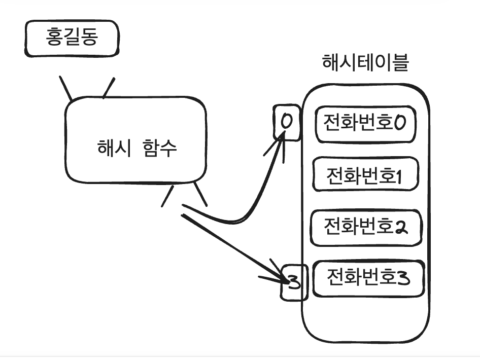
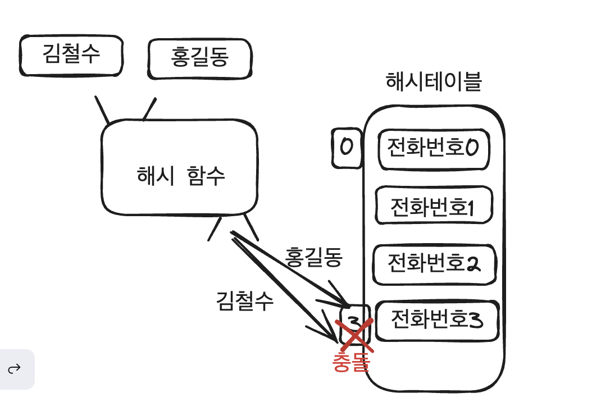

- 이 글은 골든래빗 코딩 테스트 합격자 되기 파이썬 편의 8장 써머리입니다.


### 해시의 특징 

1. 단반향으로 동작 - 키 -> 값 ✅, 값 -> 키 ❌
2. 키는 해시함수에의해 인덱스가 되므로 처음부터 하나씩 찾아보는 과정이 필요없다. 
3. 하나씩 찾아보는 순차탐색의 과정 필요없이 데이터를 쉽게 찾을 수 있으므로 효율이 좋다. 


### 해시를 활용하는 분야

- 빠르게 원하는 값을 검색. -> 특정데이터를 저장하고 검색 또는 보안이 필요한 때 사용
- 코딩 테스트에서는 데이터를 탐색하는 횟수가 많을 경우 해시 고려

리얼월드에서의 활용 분야
- 비밀번호 관리
- 데이터베이스 인덱싱
- 블록체인 


### 해시 함수 구현 

파이썬의 경우 딕셔너리의 자료형이 해시와 동일하게 동작. 

**해시 함수 구현시 고려할 내용**
- 아래 이미지 처럼 키값이 홍길동인 전화번호를 찾을 경우, 해시함수를 통한 인덱스는 테이블의 크기를 넘지 않아야 한다.



- 서로 다른 두 키에 대한 해싱 함수 결과가 동일한 경우가 최대한 적어야 한다. -> 충돌 발생이 적어야 한다.




### 자주 사용하는 해시 함수 그리고 충돌 방지 방법 

**나눗셈법**

- 키를 소수로 나눈 나머지를 활용

> h(x) = x mod k

- x는 키, k는 소수. 키를 소수로 나눈 나머지 (= x를 k로 나눈 나머지를 인덱스로 사용)
- k 가 소수여야 하는 이유?  충돌이 적기 때무. 
- 예를 들어 k가 15(15는 3의 배수이자 5의 배수->소수x) 일 경우 그리고 x는 3의 배수일 경우 `h(x) = x mod 15` 의 해시함수를 적용했을 때 반환되는 인덱스가 3,6,9,12, 0 ,3,6,9,12,0 ... 으로 충돌 한다.
- 이는 x 가 k의 약수 `3*5 =15` 이기 때문. 

**나눗셈법의 단점**

- k에 대한 모듈러 연산이므로 인덱스가 차지하는 해시테이블의 크기는 총 k 이다. 즉 데이터를 k 개 만 담을 수 있으므로, 많은 데이터를 저장해야 할 경우 큰 수의 k(=소수) 가 필요하다.
 


### 곱셈법 

- 곱셈법의 예제.
- 해시 테이블의 크기가 m = 10이고, 상수 A가 황금비율과 관련된 값 0.6180339887이라고 가정 한다. 키 k = 123456에 대한 해시 값을 계산
- k × A = 123456 × 0.6180339887 ≈ 76286.0778
- 소수 부분 추출: 0.0778
- 해시 테이블 크기와 곱셈: 0.0778 × 10 ≈ 0.778
- 내림 연산: 0.778 = 0
- 따라서 키 123456의 해시 값은 0이 된다.
- 곱셈법은 위와 같이 소수를 활용하지 않는다.  


### 문자열 해싱
- 나눗셈법과 곱셈법은 키의 자료형이 숫자인데 반해, 문자열 해싱은 키의 자료형으로 문자열을 갖는다. 

**polynomial rolling hash method**
 
- 이 함수는 문자열 해싱의 기법 중 하나이다. 
- 예를 들어 'abc'라는 단어를 해싱의 경우 여기서 'p'를 31로 정하고, 각 글자를 숫자로 바꾼다.
```
'a' = 1
'b' = 2
'c' = 3
```

- 그런 다음 각 숫자에 'p'의 거듭제곱을 곱하고 모두 더한다.

```
'a'의 해시: 1 * 31^0 = 1
'b'의 해시: 2 * 31^1 = 62
'c'의 해시: 3 * 31^2 = 2883
```

- 덧셈 연산의 경우 숫자가 너무 크면 **오버플로**가 일어날 수 있다. 이를 방지 하기 위해 모듈러 연산을 사용해 준다.
- 모두 더하면: 1 + 62 + 2883 = 2946
- 모듈러 연산: 2946 % 100 = 46
- 'abc'의 해시값은 46가 된다.
- **모듈러 연산이 있는 문제 중 큰 수를 다루는 문제는 이런 오버플로 함정에 유의!**

### 충돌 처리 방법

- 서로 다른 키에 대해 함수의 결과값(=해시테이블의 키값)과 같으면 충돌이라고 한다.

#### 1. 체이닝으로 처리하기

- 가장 간단한 방법
- 해당 버킷에 링크드 리스트를 활용하여 같은 해시값을 가지는 데이터 연결. 


#### 2. 개방 주소법으로 처리

- 버킷을 찾아 충돌값을 삽입 하는 방식.
- 해시테이블내에서 버킷을 찾으니 당연히 해시테이블을 최대한 활용하므로, 체이닝 처리 기법 보다 효율적이다. (체이닝은 링크드 리스트를 만든다 )

**2.1. 빈 버킷을 찾는 방식**
**선형 탐사 방식 (Linear Probing)**
- 충돌이 발생하면 일정한 간격을 유지하며 이동하면서 빈공간을 찾는다. 
- 여기서의 일정한 간격은 1이 일반적이다.

수식
> h(k,i)=(h(k)+i) % m      


해시 함수 `h(k)`는 주어진 키 `k`에 대한 해시 테이블 내의 초기 위치(인덱스)를 계산한다.만약 해당 위치에 이미 다른 데이터가 저장되어 있어 충돌이 발생한다면, `i`(= 일정한 간격, 1)의 값을 증가시켜 새로운 위치를 찾는다. 새 위치는 초기 해시 값 `h(k)`에 `i`를 더한 값에 mod m 연산을 적용하여 계산 한다.(mod 연산은 새 위치가 테이블의 크기를 넘어 가지 않도록 보장함). 이 과정을 반복하여 빈 위치를 찾을 때까지 계속 반복한다.

예시 

- 해시 테이블의 크기가 10이고, 데이터가 해시 함수에 의해 7번 위치에 저장되어야 한다고 가정
- 첫 번째 시도 (i=0): 위치 = (7 + 0) mod 10 = 7
- 두 번째 시도 (i=1): 위치 = (7 + 1) mod 10 = 8
- 세 번째 시도 (i=2): 위치 = (7 + 2) mod 10 = 9
그리고 이런 식으로 계속 탐사를 진행한다.

**이중 해싱 방식**
- 해시함수를 2개 사용
- 첫 번째 함수가 말해주는 자리가 차 있으면, 두 번째 함수를 이용해 새로운 자리를 찾는다. 이 과정을 반복해서 비어 있는 자리를 찾을 때까지 반복한다.
- 예를 들어 h1(k), h2(k) 해시 함수가 있고 충돌이 났을 경우, h1(k)가 7번자리에 두라고 한다. 7번 자리를 확인 하는데 이미 다른 데이터가 있다면, h2(k) 함수가 3칸 뒤에 두라고 지시하면 7번+3칸=10번째 자리를 확인한다. 10번째 자리에도 없다면 다시 h2(k)함수의 결과 값에 따라 이동하는 것을 반복한다. 


수식
>h(k,i) = (h1(k)+i * h2(k))% m
 
- 위의 수식은 실제 계산할 때 이렇게 쓰인다. 

>(h1(k)mod % m) + (i*h2(k) % m )

---

### 마무리

- 앞서 설명한 해싱의 핵심은 키와 값을 매핑하는 과정이다. 
- 큰 수를 다루는 경우 오버플로를 방지하기 위한 모듈러도 유의해야 한다.
- 특정 정보와 매핑하는 값의 관계를 확인해야 한다는 컨셉이 있다면 해시를 고려해야 한다. 