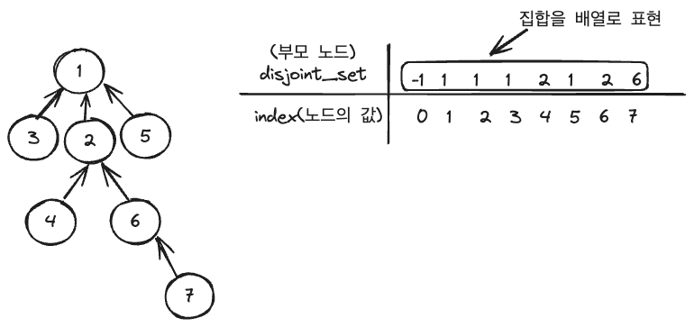
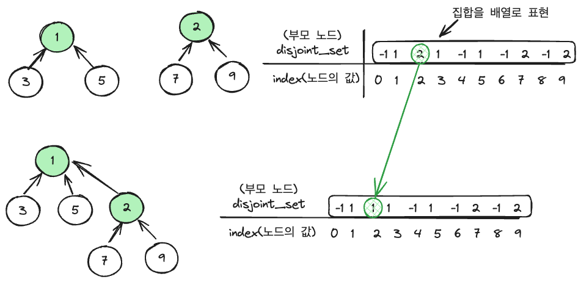

- 이 글은 골든래빗 코딩 테스트 합격자 되기 파이썬 편의 10장 써머리입니다.

## 개념 정리

### 집합의 개념

- 순서와 중복이 없는 원소들을 갖는 자료구조. ex {1,6,6,6,4,3} -> {1,6,4,3} 으로 생각해야 한다.
- **상호배타적집합** 은 교집합이 없는 집합 관계
- A = {1,2,3}, B= {4,5,6,7} 교집합이 없는 관계로 상호배타적 집합이라고 볼 수 있다.
- 상호 배타적 집합은 그래프 알고리즘에서 사이클을 확인하는 작업에 많이 활용
- 그 외 이미지 분할, 도로 네트워크 구성, 최소 신장 트리 알고리즘 구현, 게임 개발, 클러스터링 작업 등 에서 활용 될 수 있다.

### 집합 표현

- 집합은 배열을 활용한 트리로 구현.
- 즉, 하나의 배열로 상호 배타적 관계를 가지는 집합을 모두 표현한다.
- `disjoint_set[2] = 1` 의 의미는 노드 2의 부모노드는 1이다.
- `disjoint_set[1]=1` 의 경우 루트노드인 1은 집합의 대표 이므로(=대표 노드), 부모노드가 곧 자기자신이 된다.
  

### 유니온-파인드 알고리즘

- 집합 알고리즘에서 주로 쓰이는 연산이다.
- 유니온-파인드 알고리즘에서 연산의 순서는 주로 파인드가 먼저고 유니온이 나중에 연산된다.

#### 파인드 연산

- 파인드 연산은 현재노드에서 부모 노드를 순서대로 따라가면서 마지막 부모노드를 찾아 부모노드를 리턴하는 연산이다.
- 탐색 연산을 재귀함수로 하게되면 현재 노드가 부모노드와 같을 때까지 재귀 함수를 호출한다.
- 노드 7 의 루트노트는 1 이다.
- 시간복잡도는 최악의 경우 O(N)
- **경로압축** 을 통해 연산 비용을 줄일 수 있다.

#### 유니온 연산

- 두 집합을 하나로 합치는 연산.
- 즉, 두집합의 루트노드를 같게 하는 연산.
- 두 집합에서 각각 파인드 연산을 이용하여 루트노트를 찾아 내어 한 쪽의 루트노드를 다른 집합 루트 노드에 연결한다.
- 두 집합 중 어떤 루트 노드로 해도 상관 없다.



- 위와 같은 연산은 트리의 깊이가 깊어질 수록 연산 비용이 커지는 단점
- 단점을 보완하기 위해 **랭크** 기반으로 유니온 연산을 한다.
- 랭크 기반 유니온 연산은 각 집합의 트리깊이를 비교하여 **작은 트리의 깊이를 가진 루트가 큰 트리의 깊이를 가진 집합**에 합쳐진다.
- 즉 랭크 기반의 유니온 연산은 트리의 균형을 유지하기 위함이다.

## 문제풀기

### 1.폰켓몬

[프로그래머스 폰켓몬 바로가기](https://school.programmers.co.kr/learn/courses/30/lessons/1845)

이 문제는 주어진 배열에서 폰켓몬 종류의 개수를 세어 n/2보다 작으면 폰켓몬 종류 개수를, 크다면 최대 폰켓몬 종류를 선택하는 n/2를 리턴한다.
주어진 폰켓몬의 길이가 10,000 이하이니 O(n) 이면 충분 하다.
폰켓몬 종류는 해시테이블을 사용하여 {폰켓몬 종: 개수 } 로 저장한다.

```javascript
function solution(nums) {
  const hashTable = {}

  for (const num of nums) {
    hashTable[num] = (hashTable[num] || 0) + 1
  }

  const pocketmonSpeicesNum = Object.keys(hashTable).length
  return pocketmonSpeicesNum > nums.length / 2
    ? nums.length / 2
    : pocketmonSpeicesNum
}
```

### 2. 영어 끝말잇기

[영어 끝말잇기 프로그래머스 바로가기](https://school.programmers.co.kr/learn/courses/30/lessons/12981)

이 문제는 끝말잇기의 규칙을 잘 적용하여 규칙을 어긴 경우 시점의 탈락하는 사람 번호와 탈락하는 사람이 몇 번째 사이클인지를 잘 트래킹 할 수 있도록 구현 하는게 중요하다.

규칙중 `이전에 등장했던 단어는 사용할 수 없습니다.` 의 경우는 자료구조 `set`을 사용하여 set의 size 와 현재 순서를 비교하여 다르면 중복된 단어라고 간주하여 구현했다.

시간복잡도는 O(n)으로 구현이 가능하다.

```javascript
function solution(n, words) {
  const wordSet = new Set()
  let answer = [0, 0]
  words.every((word, i) => {
    let isRuleBroken = false
    wordSet.add(word)
    if (wordSet.size !== i + 1) isRuleBroken = true
    if (word.length <= 1) isRuleBroken = true
    let prev = words[i - 1]
    if (prev && prev[prev.length - 1] !== word[0]) isRuleBroken = true

    if (isRuleBroken) {
      let number = (i + 1) % n === 0 ? n : (i + 1) % n
      let nth = Math.ceil((i + 1) / n)
      answer = [number, nth]
      return false
    }
    return true
  })

  return answer
}
```

### 3. 전화번호 목록

[전화번호 목록 프로그래머스 바로 가기](https://school.programmers.co.kr/learn/courses/30/lessons/42577)

주어진 전화번호 리스트 내에서 하나의 전화번호가 다른 전화번호의 접두어가 되면 `false` 를 반환하고 그렇지 않다면 `true`를 반환한다.
이 문제는 전화번호 리스트가 1,000,000 이라는 점에서 효율성을 고려하여 구현해야 하는 점이 중요하다.
brute force 방식으로 각각 전화번호 하나에 나머지 전화번호를 모두 순회하면 시간복잡도가 O(N^2)이 되므로 시간초과가 된다.

그래서 생각한 접근법은 길이가 짧은 순서대로 정렬 후 순회하면서 같은 번호 혹은 하나의 전화번호의 부분 번호가 set에 없으면 set에 추가 하는 방식이다. 그래서 set 내에 있다면 false를 리턴하는 방식이다.
이 문제는 시간 복잡도 면에선 최악의 경우 2천만 으로 통과는 했지만 복잡도를 더 개선할 여지가 있다.  
전화번호 리스트 길이 1,000,000 \* 하나의 전화번호 길이 20 = 20,000,000

```javascript
function solution(phone_book) {
  const set = new Set()
  // 길이가 짧은 순으로 정렬- 접두어가 될 수 있는 숫자를 set에서 찾기 위해
  phone_book.sort((a, b) => a.length - b.length)

  for (const phoneNum of phone_book) {
    if (set.has(phoneNum)) return false //같은 번호 있으면 false

    let prefix = ''
    for (let i = 0; i < phoneNum.length; i++) {
      prefix += phoneNum[i]
      if (set.has(prefix)) return false
    }
    set.add(phoneNum)
  }
  return true
}
```

**성능 최적화**

- `some` 내장 함수 사용: 배열의 요소 중 하나라도 true이면 멈추고 true를 반환
- `startsWith` 내장 함수 사용 : 문자열이 특정 문자열로 시작하는지 확인
- 정렬 후, 다음 요소가 현재 요소로 시작하는 지 확인, 시작하면 true 반환 후 순회를 멈춘다.
- 문제 요구 사항에서는 false로 반환해야 하므로 ! 연산자를 사용한다.
- 마지막 요소까지 순회 했다는 것은, 이전 요소와 접두어 조건에 충족하지 않았다는 의미이므로, 더이상의 순회는 필요없음.
- 따라서 마지막 요소를 순회했을 때는 false를 반환.
- O(nlogn)

```javascript
function solution1(phone_book) {
  return !phone_book.sort().some((t, i) => {
    if (i === phone_book.length - 1) return false //마지막 인덱스는 false를 두어 무조건 true를 반환하지 않도록
    return phone_book[i + 1].startsWith(phone_book[i])
  })
}
```

### 4. <현재 풀이 진행 중인 문제>
