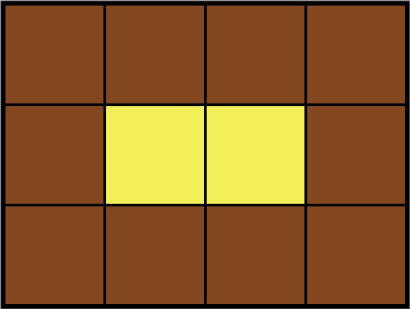

시뮬레이션 문제는 주어진 상황을 완벽하게 이해 하고 이를 코드로 구현 하는 과정으로 구현에 중점이 맞춰져 있다.

그래서 바로 문제풀이로 넘어가볼까 한다.

### 이진 변환 반복하기 출처: [프로그래머스](https://school.programmers.co.kr/learn/courses/30/lessons/70129)

> 문제 설명
> 0과 1로 이루어진 어떤 문자열 x에 대한 이진 변환을 다음과 같이 정의합니다.
> x의 모든 0을 제거합니다.
> x의 길이를 c라고 하면, x를 "c를 2진법으로 표현한 문자열"로 바꿉니다.
> 예를 들어, x = "0111010"이라면, x에 이진 변환을 가하면 x = "0111010" -> "1111" -> "100" 이 됩니다.
> 0과 1로 이루어진 문자열 s가 매개변수로 주어집니다. s가 "1"이 될 때까지 계속해서 s에 이진 변환을 가했을 때, 이진 변환의 횟수와 변환 과정에서 제거된 모든 0의 개수를 각각 배열에 담아 return 하도록 solution 함수를 완성해주세요.

```javascript
function solution(s) {
  let cnt = 0
  let zeroCnt = 0
  while (s !== '1') {
    const zeroArr = s.match(/0/g)
    if (zeroArr && zeroArr.length > 0) {
      zeroCnt += zeroArr.length
    }
    s = s.replaceAll('0', '')
    const target = s.length
    s = target.toString(2)
    cnt += 1
  }
  return [cnt, zeroCnt]
}
```

이 코드를 리팩토링 하면 이렇게도 가능하다.

```javascript
function solution(s) {
  function solution(s) {
    let cnt = 0
    let zeroCnt = 0
    while (s !== '1') {
      zeroCnt += (s.match(/0/g) || []).length
      s = s.replaceAll('0', '').length.toString(2)
      cnt += 1
    }
    return [cnt, zeroCnt]
  }
}
```

### 카펫 [출처 : 프로그래머스](https://school.programmers.co.kr/learn/courses/30/lessons/42842)

> 문제설명
> Leo는 카펫을 사러 갔다가 아래 그림과 같이 중앙에는 노란색으로 칠해져 있고 테두리 1줄은 갈색으로 칠해져 있는 격자 모양 카펫을 봤습니다.



> Leo는 집으로 돌아와서 아까 본 카펫의 노란색과 갈색으로 색칠된 격자의 개수는 기억했지만, 전체 카펫의 크기는 기억하지 못했습니다.
> Leo가 본 카펫에서 갈색 격자의 수 brown, 노란색 격자의 수 yellow가 매개변수로 주어질 때 카펫의 가로, 세로 크기를 순서대로 배열에 담아 return 하도록 solution 함수를 작성해주세요.

이 문제는 주어진 yellow를 만들 수 있는 모든 가로의 길이를 하나씩 늘려가면서, yellow를 둘러싸는 brown 격자의 수를
구하여 주어진 brown과 일치하면 brown의 가로, 세로 격자를 리턴한다. yellow의 가로 길이를 1부터 하나씩 늘려가면서 조건에 맞는지 찾는 방법을 통해 완전 탐색임을 알 수 있다.

```javascript
/**
 *
 * TimeComplexity: O(yellow/2)
 * @param {*} brown
 * @param {*} yellow
 * @returns
 */
function solution(brown, yellow) {
  let yellow_w = 0
  let brown_w = 0
  let brown_h = 0
  // yellow가 1이면 가로, 세로 길이는 3 (최솟값)
  if (yellow === 1) {
    return [3, 3]
  }
  // yellow_h 를 1부터 yellow/2까지 반복
  for (let yellow_h = 1; yellow_h <= yellow / 2; yellow_h++) {
    //yellow의 가로길이가 정수인지 확인
    if (yellow % yellow_h !== 0) continue
    //yellow의 가로 길이 구하기
    yellow_w = Math.floor(yellow / yellow_h)
    // yellow의 가로 길이가 세로 길이보다 작으면 continue
    if (yellow_h > yellow_w) continue
    // brown의 가로, 세로 길이 구하기
    brown_w = yellow_w + 2
    brown_h = yellow_h + 2
    // brown의 가로, 세로 길이가 맞으면 break
    if (brown_w * 2 + brown_h * 2 - 4 === brown) break

    yellow_w += 1
  }
  return [brown_w, brown_h]
}
```

### 롤 케이크 자르기 [출처 : 프로그래머스](https://school.programmers.co.kr/learn/courses/30/lessons/132265)

문제 요점

> 문제 설명
> 철수는 롤케이크를 두 조각으로 잘라서 동생과 한 조각씩 나눠 먹으려고 합니다. 이 롤케이크에는 여러가지 토핑들이 일렬로 올려져 있습니다. 철수와 동생은 롤케이크를 공평하게 나눠먹으려 하는데, 그들은 롤케이크의 크기보다 롤케이크 위에 올려진 토핑들의 종류에 더 관심이 많습니다. 그래서 잘린 조각들의 크기와 올려진 토핑의 개수에 상관없이 각 조각에 동일한 가짓수의 토핑이 올라가면 공평하게 롤케이크가 나누어진 것으로 생각합니다.
> 예를 들어, 롤케이크에 4가지 종류의 토핑이 올려져 있다고 합시다. 토핑들을 1, 2, 3, 4와 같이 번호로 표시했을 때, 케이크 위에 토핑들이 [1, 2, 1, 3, 1, 4, 1, 2] 순서로 올려져 있습니다. 만약 세 번째 토핑(1)과 네 번째 토핑(3) 사이를 자르면 롤케이크의 토핑은 [1, 2, 1], [3, 1, 4, 1, 2]로 나뉘게 됩니다. 철수가 [1, 2, 1]이 놓인 조각을, 동생이 [3, 1, 4, 1, 2]가 놓인 조각을 먹게 되면 철수는 두 가지 토핑(1, 2)을 맛볼 수 있지만, 동생은 네 가지 토핑(1, 2, 3, 4)을 맛볼 수 있으므로, 이는 공평하게 나누어진 것이 아닙니다. 만약 롤케이크의 네 번째 토핑(3)과 다섯 번째 토핑(1) 사이를 자르면 [1, 2, 1, 3], [1, 4, 1, 2]로 나뉘게 됩니다. 이 경우 철수는 세 가지 토핑(1, 2, 3)을, 동생도 세 가지 토핑(1, 2, 4)을 맛볼 수 있으므로, 이는 공평하게 나누어진 것입니다. 공평하게 롤케이크를 자르는 방법은 여러가지 일 수 있습니다. 위의 롤케이크를 [1, 2, 1, 3, 1], [4, 1, 2]으로 잘라도 공평하게 나뉩니다. 어떤 경우에는 롤케이크를 공평하게 나누지 못할 수도 있습니다.
> 롤케이크에 올려진 토핑들의 번호를 저장한 정수 배열 topping이 매개변수로 주어질 때, 롤케이크를 공평하게 자르는 방법의 수를 return 하도록 solution 함수를 완성해주세요.

이 문제는 문제에서 주어진 토핑의 left와 right를 나누어 그대로 구현하였다. 구현 자료구조는 Map을 이용하여 left와 right에 토핑을 넣고 빼는 방식으로 접근하였다.

```javascript
/**
 *
 *
 * Time Complexity : O(n)
 * @param {*} topping
 * @returns
 */
function solution(topping) {
  var answer = 0
  let left = []
  let right = []
  const leftToppingMapper = new Map()
  const rightToppingMapper = new Map()
  // 초기 right에 모든 토핑을 넣고, 토핑의 개수를 센다
  topping.forEach((v) => {
    rightToppingMapper.set(v, (rightToppingMapper.get(v) || 0) + 1)
    right.push(v)
  })
  //주어진 토핑만큼 순회하면서 right에서 하나씩 pop 하여, left에 넣는다.
  // 순회는 right가 빌때까지 한다.
  while (right.length) {
    //left로 옮기기
    const last = right.pop()
    left.push(last)
    //left에 토핑을 추가 한다.
    leftToppingMapper.set(last, (leftToppingMapper.get(last) || 0) + 1)
    //right에서 토핑을 제거한다.
    rightToppingMapper.set(last, rightToppingMapper.get(last) - 1)
    //right에서 토핑을 제거할 때, 0 이 되면 map에서 제거한다.
    if (rightToppingMapper.get(last) === 0) {
      rightToppingMapper.delete(last)
    }
    // map에 저장된 key의 개수로 비교하여 같으면 answer를 증가시킨다.
    if (leftToppingMapper.size === rightToppingMapper.size) {
      answer += 1
    }
  }
  return answer
}
```

### 점프와 순간이동 [출처:프로그래머스](https://school.programmers.co.kr/learn/courses/30/lessons/12980)

> 문제 설명
> OO 연구소는 한 번에 K 칸을 앞으로 점프하거나, (현재까지 온 거리) x 2 에 해당하는 위치로 순간이동을 할 수 있는 특수한 기능을 가진 아이언 슈트를 개발하여 판매하고 있습니다. 이 아이언 슈트는 건전지로 작동되는데, 순간이동을 하면 건전지 사용량이 줄지 않지만, 앞으로 K 칸을 점프하면 K 만큼의 건전지 사용량이 듭니다. 그러므로 아이언 슈트를 착용하고 이동할 때는 순간 이동을 하는 것이 더 효율적입니다. 아이언 슈트 구매자는 아이언 슈트를 착용하고 거리가 N 만큼 떨어져 있는 장소로 가려고 합니다. 단, 건전지 사용량을 줄이기 위해 점프로 이동하는 것은 최소로 하려고 합니다. 아이언 슈트 구매자가 이동하려는 거리 N이 주어졌을 때, 사용해야 하는 건전지 사용량의 최솟값을 return하는 solution 함수를 만들어 주세요.
> 예를 들어 거리가 5만큼 떨어져 있는 장소로 가려고 합니다.
> 아이언 슈트를 입고 거리가 5만큼 떨어져 있는 장소로 갈 수 있는 경우의 수는 여러 가지입니다.
> 처음 위치 0 에서 5 칸을 앞으로 점프하면 바로 도착하지만, 건전지 사용량이 5 만큼 듭니다.
> 처음 위치 0 에서 2 칸을 앞으로 점프한 다음 순간이동 하면 (현재까지 온 거리 : 2) x 2에 해당하는 위치로 이동할 수 있으므로 위치 4로 이동합니다. 이때 1 칸을 앞으로 점프하면 도착하므로 건전지 사용량이 3 만큼 듭니다.
> 처음 위치 0 에서 1 칸을 앞으로 점프한 다음 순간이동 하면 (현재까지 온 거리 : 1) x 2에 해당하는 위치로 이동할 수 있으므로 위치 2로 이동됩니다. 이때 다시 순간이동 하면 (현재까지 온 거리 : 2) x 2 만큼 이동할 수 있으므로 위치 4로 이동합니다. 이때 1 칸을 앞으로 점프하면 도착하므로 건전지 사용량이 2 만큼 듭니다.
> 위의 3가지 경우 거리가 5만큼 떨어져 있는 장소로 가기 위해서 3번째 경우가 건전지 사용량이 가장 적으므로 답은 2가 됩니다.
> 제한 사항
> 숫자 N: 1 이상 10억 이하의 자연수
> 숫자 K: 1 이상의 자연수

이 문제는 점프 할 때와 순간 이동 할 때의 모든 경우의 수에서 도착지점까지의 최소값을 구하는 방법으로 접근하였다.
하지만 N이 10 억이므로 DFS로는 시간초과가 난다.

```javascript
/**
 *
 * @param {*} n
 * @returns
 */
function solution(n) {
  let minVals = []
  dfs(1, 1)

  function dfs(curVal, curLocation) {
    if (curLocation === n) {
      minVals.push(curVal)
      return
    }

    dfs(curVal + 1, curLocation + 1) //jump

    if (curLocation * 2 > n) {
      return
    }
    dfs(curVal, curLocation * 2) //순간이동
  }
  return Math.min(...minVals)
}
```

문제의 규칙을 잘 활용하는 것이 이 문제의 핵심이다.

순간이동의 경우 현재 위치에서 다음위치는 2배이다. 즉 도착지점(N)이 짝수이면 순간이동을 했다는 의미이므로 N/2로 이동한다. 이 때 배터리 소비는 없다.

도착지점이 홀수인 경우는 점프를 했다고 볼 수 있다.

그럼 도착지점을 2로 나누어 0으로 떨어지면 배터리 소비는 없으며, 2로 나누어 나머지가 1이 되면 점프를 한 번 했다고 볼 수 있다.

이진수로 변환하는 과정과 같다.

```javascript
function solution(n) {
  return Array.from(n.toString(2)).filter((v) => v === '1').length
}
```

### 캐릭터의 좌표 [출처:프로그래머스](https://school.programmers.co.kr/learn/courses/30/lessons/120861)

> 문제설명
> 머쓱이는 RPG게임을 하고 있습니다. 게임에는 up, down, left, right 방향키가 있으며 각 키를 누르면 위, 아래, 왼쪽, 오른쪽으로 한 칸씩 이동합니다. 예를 들어 [0,0]에서 up을 누른다면 캐릭터의 좌표는 [0, 1], down을 누른다면 [0, -1], left를 누른다면 [-1, 0], right를 누른다면 [1, 0]입니다. 머쓱이가 입력한 방향키의 배열 keyinput와 맵의 크기 board이 매개변수로 주어집니다. 캐릭터는 항상 [0,0]에서 시작할 때 키 입력이 모두 끝난 뒤에 캐릭터의 좌표 [x, y]를 return하도록 solution 함수를 완성해주세요.
> [0, 0]은 board의 정 중앙에 위치합니다. 예를 들어 board의 가로 크기가 9라면 캐릭터는 왼쪽으로 최대 [-4, 0]까지 오른쪽으로 최대 [4, 0]까지 이동할 수 있습니다.

이 문제는 주어진 이동하는 좌표를 그대로 매핑 객체로 설정해 두고,
시작좌표들을 순회하면서 board의 경계를 판단하여 경계 내에 있다면 현재 좌표와 순회하는 시작 좌표를 더해준다.

```javascript
function solution(keyinput, board) {
  const controlMapper = {
    left: [-1, 0],
    right: [1, 0],
    up: [0, 1],
    down: [0, -1],
  }
  let cur = [0, 0] //시작 좌표
  for (const key of keyinput) {
    const [a, b] = controlMapper[key]
    const [curA, curB] = cur
    const w = Math.floor(board[0] / 2) //가로 좌표
    const h = Math.floor(board[1] / 2) //세로 좌표
    // 주어진 board 의 경계를 벗어나면 입력 무시
    if (-w > curA + a || w < curA + a || curB + b > h || curB + b < -h) continue
    cur = [a + curA, b + curB]
  }

  return cur
}
```
