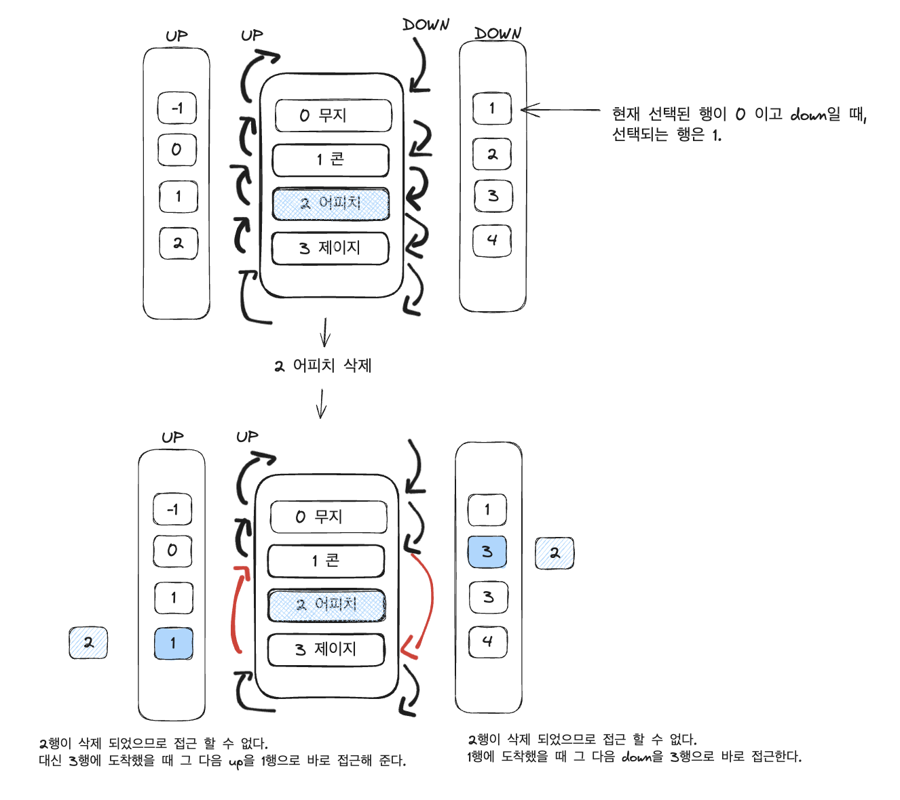

### 들어가며 

- 문제를 풀 때 문제의 정확도와 효율성을 고려한 자료구조를 생각해 내는게 쉽진 않다. 
- 이번 스터디에서 스택,큐를 진행하면서 코딩테스트 합격자되기에 수록 되어 있는 문제인 2021 카카오 채택 연계형 인턴쉽 문제 "표 편집"에서 부분적으로 스택을 이용하였지만 결국엔 효율성 부분에서 잘 풀어내지 못했다.
- 이 알고리즘을 선택한 이유와 효율성을 개선하기 위해 다른 자료구조를 고려할 수 있는 이유를 복기하며 글을 쓰려고 합니다
- 골든래빗 코딩 테스트 합격자 되기 파이썬 편의 6장 ~ 7장 써머리가 포함되어 있습니다.


---

### 스택

먼저 스택에 대해 알아보자. 

- 스택 구조를 이해하는 예로는 티슈를 생각할 수 있다.
- 티슈를 처음 만들 땐 먼저 넣은 티슈가 가장 아래에 위치한다.
- 티슈를 다 만들고 나서 사용할 때에는 맨 위에 있는 티슈 부터 뽑으므로, 가장 나중에 넣은 티슈를 사용할 수 있다.
- 먼저 들어간 것이 마지막에 나오는 규칙을 갖고 있다. (= 선입후출, First In Last Out, FIFO)  

### 스택의 ADT 

| 정의      | 설명                                   | 리턴 타입                              |
| -------- | ------------------------------------- | ----------------------------------- |
| isFull()   | 스택에 들어 있는 데이터 개수가 maxsize라면 True, 아니면 False | boolean |
| isEmpty()  | 스택에 들어 있는 데이터가 하나라도 있으면 False, 아니면 True| boolean |
| push(ItemType item)   | 스택에 데이터를 넣는다.     | void                               |
| pop()  |  스택에서 가장 최근에 넣은 데이터를 꺼내고, 그 데이터를 반환.  | Item Type                    |
| top    |  스택에서 최근 푸시한 데이터의 위치           | Int|


---

### 2021 카카오 채택 연계형 인턴십 표 편집


#### 나의 접근법

내가 푼 문제의 접근 방법은, index를 이용하여 up, down시 이동을 하고, 삭제의 경우 javascript의 delete 연산을 이용하여 배열의 길이를 변경하지 않은채 `undefined` 로 변경 한 후, index를 문제 조건에 맞추어 위, 아래로 변경하였다.
delete시 중요한점은 복구할 때 가장 최신에 지운 행을 다시 기억해야 하므로, delete 바로 전 stack에 행의정보를 저장한다. 
나의 경우 deletedStack = [[행의 index, value]] 로 저장했다. 
그래서 복구의 경우 deletedStack을 pop 하여 기존 배열에 `undefined`로 되어 있던 요소를  `row[index] = value` 로 재할당 해주었다.

하지만 정확도 29/30에 효율성 5/10 으로 성능을 바꾸려 이리저리 시도했지만, 결국 뾰족한 자료구조를 찾을 수 없었다. 
처음 시도한 코드는 아래와 같다.

내 코드의 문제점은 
1. 배열에서 삭제 후, up, down을 할 때 모든 요소들을 순회하면서 `undefined` 가 있으면 count에 포함하지 않는 방식으로, 모든 요소를 순회한다는 점이다. 

2. 삭제 되었을 때, 삭제 된 행이 배열의 마지막일 경우, 선택된 행을 삭제된 행의 바로 위의 위치에 있는 행으로 변경 해야 하는데, 이 과정에서 배열의 길이를 변경하지 않았으므로, 배열의 마지막 행이 `undefined`가 아닌 행을 또 찾기 위해 순회를 해야 한다는 점이다.


```javascript
/**
 * 정확성: 29/30, 효율성 5/10
 * @param {*} n
 * @param {*} k
 * @param {*} cmd
 * @returns
 */
function solution(n, k, cmd) {
  var answer = "";
  let current = k;
  let row = Array.from({ length: n }, (v, i) => i);
  let deletedStack = [];
  for (const index in cmd) {
    const [direction, num = 0] = cmd[index].split(" ");
    if (direction === "D") {
      let temp = 0;
      let count = Number(num);
      while (count > 0 && current < row.length) {
        current = current += 1;
        if (row[current]) {
          count--;
        }
      }
      continue;
    }
    if (direction === "U") {
      let count = Number(num);

      while (count > 0 && current >= 0) {
        current = current - 1;
        if (row[current]) {
          count -= 1;
        }
      }
      continue;
    }
    if (direction === "C") {
      deletedStack.push([current, row[current]]);

      delete row[current];

      //find next current
      let tempCurrent = current;
      let isFound = false;
      while (tempCurrent < row.length) {
        if (row[tempCurrent]) {
          isFound = true;
          break;
        }
        tempCurrent += 1;
      }
      if (isFound) {
        current = tempCurrent;
      } else {
        let temp = current;
        //반대로 작아져야 함.
        while (temp >= 0) {
          if (row[temp]) {
            current = temp;
            break;
          }
          temp--;
        }
      }
      continue;
    }
    if (direction === "Z") {
      //current는 변경 x
      //restore
      const currentValue = row[current];
      if (!deletedStack.length) continue;
      const [index, value] = deletedStack.pop();
      row[index] = value;
      continue;
    }
  }
  // compare
  for (const num of row) {
    if (num === undefined) {
      answer += "X";
    } else {
      answer += "O";
    }
  }
  return answer;
}
```

#### 책을 참고한 문제 접근법 

1. `LinkedList` 자료구조의 개념을 활용한 방법으로 삭제 된 행이 있다면, 삭제된 행의 기준으로 위, 아래 행 을 바로 연결시켜 준다. 
이 방법은 내 코드의 문제점인 모든 행을 순회할 필요없이, 삭제된 행을 제외하고 그 다음 행이 어디인지를 O(1)의 접근으로 효율적인 성능을 보여준다.




```javascript
// 정확도: 30, 효율성: 70

function solution(n, k, cmd) {
  var answer = Array(n).fill("O");
  let current = k+1;
  let deletedStack = [];
  let up =  Array.from({ length: n+2 }, (v, i) => i-1);
  let down = Array.from({length: n+1},(v,i)=>i+1);
  
  for (const index in cmd){
    const [direction, num = 0] = cmd[index].split(" ");
      
      if(direction === "C"){
          deletedStack.push(current);
          up[down[current]] = up[current]
          down[up[current]] = down[current]
          current = n<down[current] ? up[current] : down[current];
          continue;
      }
      if(direction === "Z"){
          const deletedRow = deletedStack.pop();
          down[up[deletedRow]] = deletedRow;
          up[down[deletedRow]] = deletedRow;
          continue
      }
      
      if(direction ==="U"){
          for(let i =0; i<Number(num); i++){
              current = up[current]
          }
          continue;
      }
      if(direction === "D"){
          for(let i =0; i<Number(num); i++){
              current = down[current]
          }
          continue;
      }
      
      
  }
    //삭제된 행은 deletedStack에서 찾는다.
  
     while(deletedStack.length){
          const row = deletedStack.pop()
          answer[row-1] = "X"
      }
    return answer.join("")
}
```

### 회고 

- 삭제된 행이 있을 때 불필요한 연산을 없애고 다음 행이 어딘지를 알리는 `LinkedList` 를 생각못한 부분이 아쉬웠지만, 이번 기회에 제대로 활용해 볼 수 있었다. 


