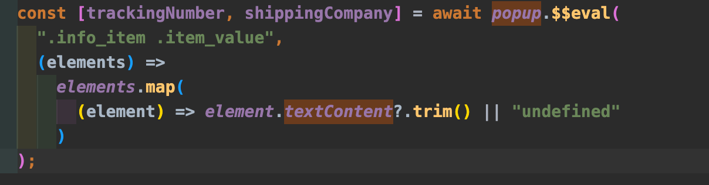

# AWS Lambda, playwright을 활용한 슬랙 챗봇 개발기

소미에는 배송정보 요청하기라는 기능이 있다. 아직까지 서비스에선 배송정보를 미리 알려주지 않고 배송정보요청을 원하는 유저에게만 기능을 제공하고 있다.

기능이 고도화 되진 않아 어드민이 요청 처리를 하기 위해선 일련의 수동작업을 거치게 된다. 1.배송정보 요청 탭에 요청건에 대한 이름, 주문한 커머스 등의 정보를 확인하고,

2.네이버로 로그인을 한다

1. 주문 현황페이지 방문하여 이름과 일치하는 주문을 찾는다.
2. 주문의 현황 상태를 확인 후

- 배송정보 API 서비스 이용
- 크롤링

## **AWS Lambda 선택 이유와 트레이드 오프**

AWS Lambda를 선택한 주된 이유는 무엇보다도 "서버리스(Serverless)" 아키텍처의 이점 때문이었습니다. Lambda를 사용하면 서버 관리의 부담 없이 코드를 실행할 수 있으며, 사용한 만큼만 비용을 지불하게 됩니다. 이는 특히 우리와 같이 가변적인 트래픽을 처리하는 서비스에 매우 적합한 선택이라고 생각했다.

물론, 트레이드 오프도 존재 한다. Lambda의 경우, 실행 시간, 메모리 등에 제한이 있어서, 더 복잡하고 자원 집약적인 작업에는 적합하지 않을 수 있다는데, 또한 "콜드 스타트" 문제로 초기 응답 시간이 길어질 수 있다는 점을 리서치를 통해 알게 되었는데 사실 이 부분에 대해서는 자세히 들여다 보질 못했다. 슬랙에서 동작이 되니 다시 보게 될 기회가 없었다.

## Playwright 선택이유

playwright는 이전 회사에서 E2E테스트 작성을 할 때 사용했던 도구로 그 때 당시 팀회의를 통해 pupeteer와 비교하여 playwright의 이점을 인지 있었다.

도구들 중 큰 차이가 없다면 그나마 익숙한 도구를 사용하는 것이 `First Time To Hello` 를 보기엔 제격이라고 생각했고 일단 빠르게 만든다라는 목표에 집중해서 선택했다.

playwright는 pupeteer보다 developer experience가 더 좋다고 주장했었다.

특히 자동 지연 처리부분을 적용하고 개선했다고 했었다.

예전 pupeteer를 사용할 당시 유저의 액션처리 과정에서 드랍되는 현상들이 빈번하여 이럴 땐 `wait()` 를 사용하여 물리적으로 지연을 주곤 했는데, 지연이 많을 수록 성능적으로 좋지 않은 건 당연하다.이런 부분을 playwright에서는 개선했다고 한다.

## **AWS Lambda의 구조 간략 설명**

AWS Lambda는 이벤트 기반, 서버리스 컴퓨팅 서비스입니다. 간단히 말해서, 특정 이벤트가 발생하면 AWS에서 코드를 자동으로 실행해주는 서비스이다. Lambda 함수는 독립적으로 실행되며, 필요한 모든 것은 AWS가 관리합니다. 이는 개발자로 하여금 인프라 관리보다 비즈니스 로직 개발에 더 집중할 수 있게 해준다.

현재 aws lambda 페이지의 기본적인 전체구조 및 흐름이다.

1. **API Gateway**: Amazon API Gateway는 클라이언트와 백엔드 사이의 “문”과 같은 역할을 한다. API Gateway에 정의된 URL로 HTTP 요청을 보내면, API GateWay가 이 요청을 받아 Lambda함수를 호출하고, Lambda함수의 처리결과를 다시 API Gateway를 통해 클라이언트에게 응답할 수 있다. 이HTTP요청엔 query paramerter 를 이용하여 요청도 가능하다.
2. **Lambda 함수 호출**: API Gateway는 요청에 맞는 Lambda 함수를 호출합니다.
3. **EventBridge 이벤트 처리**: EventBridge는 다양한 이벤트를 감지하고, 이에 반응하여 Lambda 함수를 트리거할 수 있습니다.
4. **Cron Job 스케줄링**: CloudWatch Events의 Cron 표현식을 사용하면 정해진 시간 예를 들어 아침 9시 에 Lambda함수는 자동으로 호출 할 수 있다. 이를 통해 주기적인 데이터 처리 등의 작업을 자동화할 수 있다.
5. **Lambda 함수 실행**: Lambda 함수가 실행되어 필요한 작업을 수행하고 결과를 반환합니다.
6. **결과 처리**: API Gateway를 통해 클라이언트에게 결과를 응답하거나, 다른 AWS 서비스로 결과를 전송합니다.

## **호출 진행 과정**

1. **이벤트 트리거**: 매일 아침마다 특정 시간에 Lambda 함수를 트리거하기 위해 AWS CloudWatch Events를 사용했습니다. 이렇게 설정하면, 정해진 시간에 자동으로 Lambda 함수가 호출됩니다.
2. **데이터 처리**: 호출된 Lambda 함수는 Playwright를 사용하여 네이버 주문 리스트에 접근합니다. 여기서 필요한 배송 정보를 추출합니다.
3. **슬랙 챗봇 통신**: 추출된 배송 정보는 슬랙 API를 통해 슬랙 챗봇으로 전송됩니다. 챗봇은 이 정보를 적절한 포맷으로 가공하여 슬랙 채널에 메시지를 보냅니다.


다음은 AWS 적용시 참고하면 좋을 주의사항이다.

이 함수에도 제한이 있다. 15분, 그리고 메모리 할당량도 10GB까지 나타낸다.


[Lambda 할당량 - AWS Lambda](https://docs.aws.amazon.com/ko_kr/lambda/latest/dg/gettingstarted-limits.html)


적용하는 과정에서 마주한 이슈들도 있었다.

1. **AWS Lambda 환경 에서의 Playwright 사용 이슈**

빠르게 코드를 작성한 후, zip파일로 묶어 빠르게 aws gui를 통해 업로드 한 결과는 실패였다.

```json
{
  "errorType": "Error",
  "errorMessage": "browserType.launch: Executable doesn't exist at /home/sbx_user1051/.cache/ms-playwright/chromium-1067/chrome-linux/chrome\n╔═════════════════════════════════════════════════════════════════════════╗\n║ Looks like Playwright Test or Playwright was just installed or updated. ║\n║ Please run the following command to download new browsers:              ║\n║                                                                         ║\n║     npx playwright install                                              ║\n║                                                                         ║\n║ <3 Playwright Team                                                      ║\n╚═════════════════════════════════════════════════════════════════════════╝",
  "trace": [
    "browserType.launch: Executable doesn't exist at /home/sbx_user1051/.cache/ms-playwright/chromium-1067/chrome-linux/chrome",
    "╔═════════════════════════════════════════════════════════════════════════╗",
    "║ Looks like Playwright Test or Playwright was just installed or updated. ║",
    "║ Please run the following command to download new browsers:              ║",
    "║                                                                         ║",
    "║     npx playwright install                                              ║",
    "║                                                                         ║",
    "║ <3 Playwright Team                                                      ║",
    "╚═════════════════════════════════════════════════════════════════════════╝",
    "    at initCrawler (file:///var/task/index.js:21:34)",
    "    at Runtime.handler (file:///var/task/index.js:205:30)",
    "    at Runtime.handleOnceNonStreaming (file:///var/runtime/index.mjs:1086:29)"
  ]
}
```

로컬환경에서의 playwright를 사용할 때는 playwright를 설치 할 때, headless browser 동작을 위해 자동으로 Chrome, Firefox, Webkit 등과 같은 필요한 브라우저들을 다운받고 설치한다. 이 과정에서 필요한 브라우저 실행 파일들이 로컬 시스템에 저장되는데, Lambda의 서버리스 컴퓨팅 환경에서는 Playwright가 필요로 하는 브라우저 실행파일이 포함되어 있지 않다.

이는 AWS Lambda의 stateless 특성과도 연관이 있는데, 람다함수가 이벤트에 의해 트리거 될 때마다 완전히 새로운 환경에서 호출된다.

결국 AWS Lambda환경에서 Playwright가 headless browser 동작을 하기 위해 브라우저 바이너리가 필요하다.

puppeteer 를 참고한 자료에서 찾을 수 있었는데, **[chrome-aws-lambda](https://github.com/alixaxel/chrome-aws-lambda) 를 이용하는 것이다.**

chrome-aws-lambda 는 웹브라우저를 실행하는데 필요한 바이너리로 chrome 바이너리이다.


그리고 Memory도 512MB로 재할당 해준다. 메모리 설정은 lambda → configuration에서 가능하다.


이제 코드로 돌아가서 다시 디펜던시를 설치한 후 뼈대 코드 베이스는 다음과 같다.

```jsx
const express = require("express");
const chromium = require("chrome-aws-lambda"); //✅ chrome binary
const playwright = require("playwright-core"); //✅ playwright-core, ❌playwright
const { WebClient } = require("@slack/web-api"); //✅ slack api
const { initCrawler } = require("./service");
const app = express();
const port = 3000;

//http
const http = require("http");
const server = http.createServer(app);
const isDev = process.env.NODE_ENV !== "production";

// env
const SLACK_BOT_TOKEN = process.env.SLACK_BOT_TOKEN;
const SLACK_CHANNEL = process.env.SLACK_CHANNEL;

const NAVER_ID = process.env.NAVER_ID;
const NAVER_PW = process.env.NAVER_PW;

const naverLoginUrl =
  "https://nid.naver.com/nidlogin.login?mode=form&url=https://www.naver.com";
const slack = new WebClient(SLACK_BOT_TOKEN);

//create lambda function ✅실제 람다함수가 호출을 담당하는 handler 함수이다.
exports.handler = async (event, context, callback) => {
	// ✅ playwright-core 에 있는 chromium 브라우저 엔진을 시작한다.
  const browser = await playwright.chromium.launch({
    args: chromium.args,
    executablePath: await chromium.executablePath,
    headless: chromium.headless, // 이 구간이 headless여야 실제 창이 뜨지 않는다(GUI를 위한 메모리가 더 필요하기 때문)
  });

  let shippingOrders = [];
  try {
    shippingOrders = await initCrawler(browser);
    // shippingOrders의 첫번째 주문 번호 json에 담기
	}catch(){}

}
```

1. popup창 내의 element에 있는 배송상태를 가져오는게 가능할까?

   하나의 주문번호에 다른 상점에서 구매한 여러개의 아이템의 배송정보들이 popup으로 되어있는 경우, 각각의 모든 아이템들의 popup 내 element를 읽어서 배송상태 를 가져와야 했다. 다른 우회적인 방법으로 배송상태를 알 수 있는 방법이 없을까 하고 열심히 naver를 탐색했지만 결국 이 방법만이 유일하게 배송상태를 볼 수 있었다.

   playwright에선 popup도 지원해줄까?

   page.waitForEvent(”popup”) 을 통해 가능하다.

   

### 슬랙봇 연동

`initCrawler()` 를 통해 함수를 실행 시킨 후 결과들을 가독성있게 포매팅 한 후, slack api를 활용하여 데이터를 전송한다.

여러개의 자료들을 보았는데, 아래의 슬랙 공식 문서 보다 더 확실한건 없다.

[Quickstart](https://api.slack.com/start/quickstart)

참고 자료

https://www.pluralsight.com/resources/blog/cloud/serverless-browser-automation-with-aws-lambda-and-puppeteer
