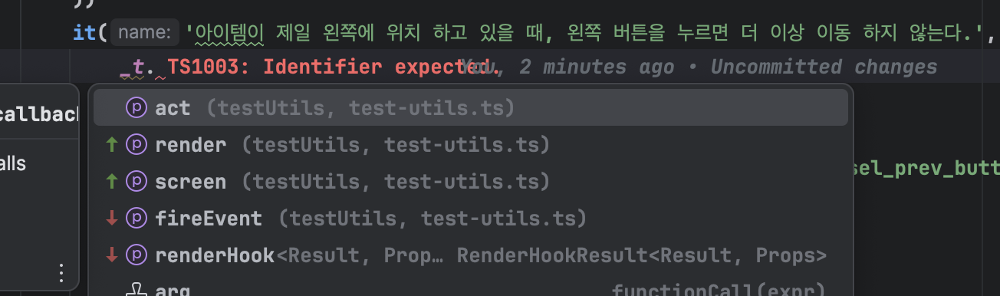
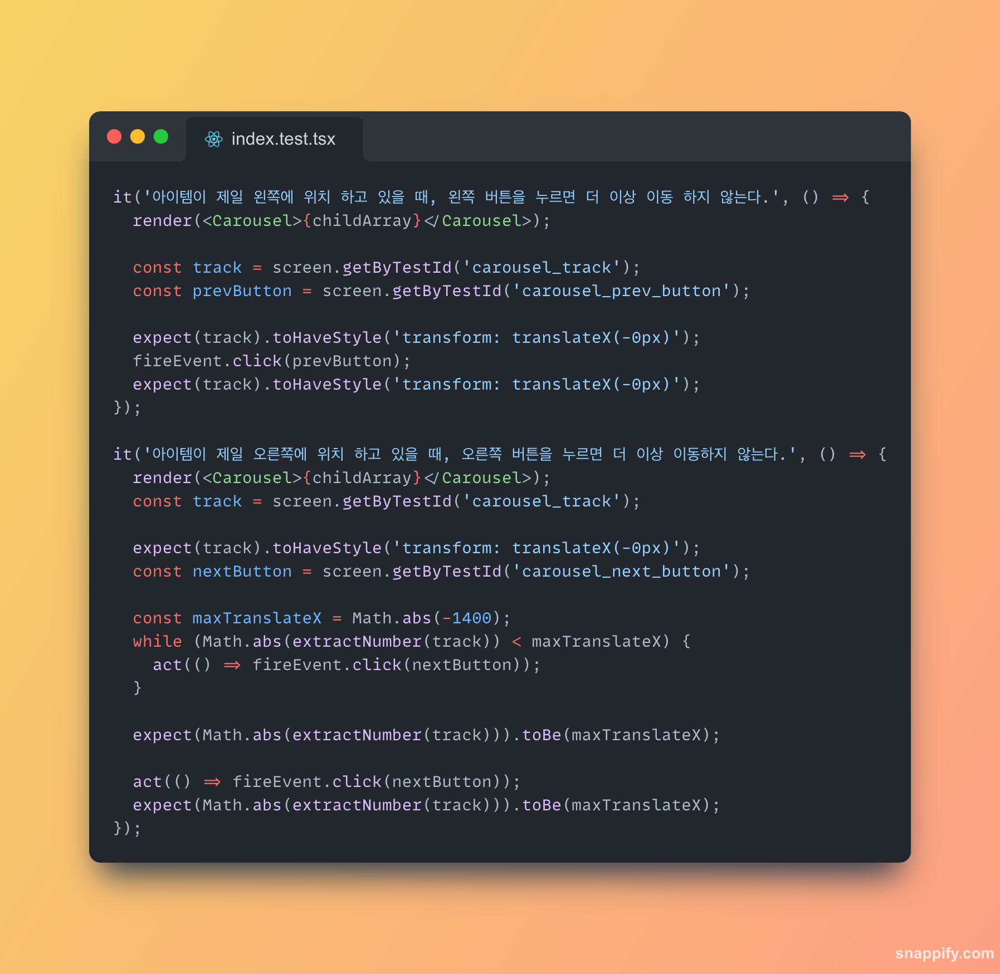
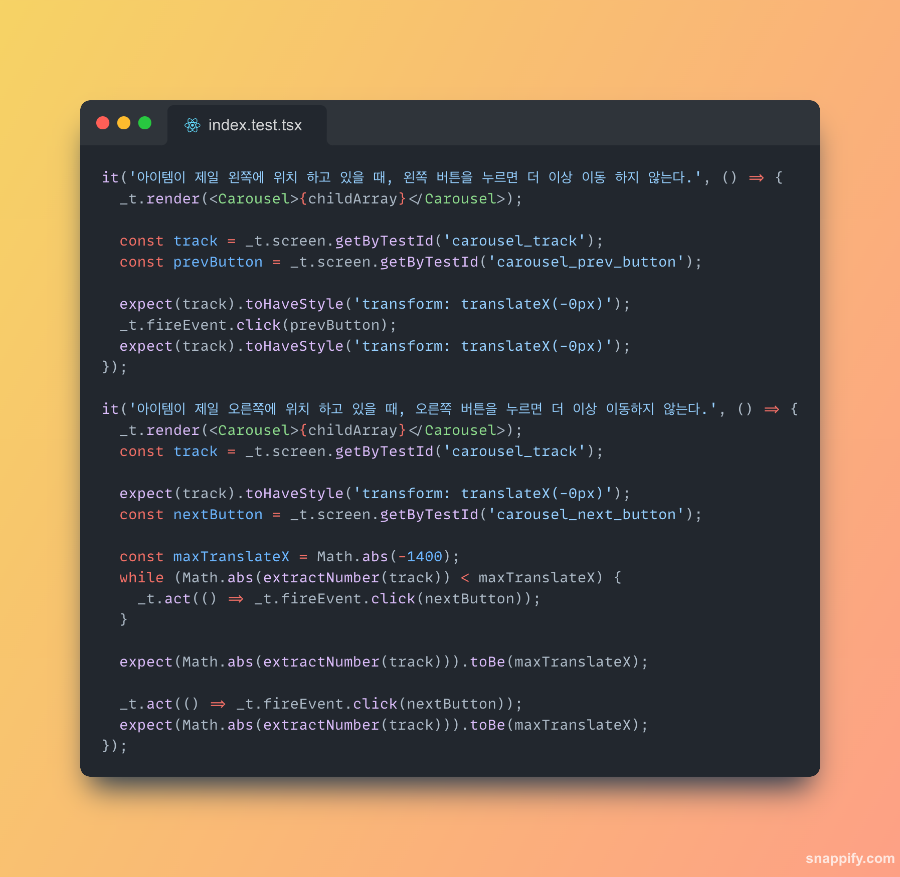

<br/>
<br/>

## 1. 들어가며
<br/>
<br/>

리액트 테스팅 라이브러리를 사용하다보면, `screen`, `render`, `fireEvent` 등의 메서드를 사용하게 됩니다.
이 메서드들은 자주 사용되는데요. scrren의 예로  `screen.getByText` 에 접근할 때 자동완성이 됩니다. 하지만 `screen` 은 타이핑을 직접 해주어야 했는데요. 
그래서 이 조차도 자동완성이 되게 하면 타이핑에 생산성이 올라가지 않을까 생각했습니다. 이번 포스팅에서는 이러한 테스팅 라이브러리의 메서드들을 타입스크립트를 활용하여 자동 완성으로 사용해 본 경험담을 담았습니다.
<br/>
<br/>
<br/>
<br/>
<br/>

## 2. d.ts 타입선언으로 리액트 테스팅 라이브러리 메서드 자동 완성 활용하기
<br/>
<br/>

먼저 `@testing-library/react` 라이브러리 의존성에서 screen, render를 사용하는 경우를 살펴보겠습니다.
<br/>

```tsx
import { render, screen } from '@testing-library/react';

test('renders learn react link', () => {
  render(<App />);
  const linkElement = screen.getByText(/learn react/i);
  expect(linkElement).toBeInTheDocument();
});
```
<br/>

먼저 생각 나는 아이디어는 `_t.`를 하면 자동 완성으로 자주 쓰는 메서드 들을 나오게 하면 어떨까 였는데요. 

이 아이디어를 실현하기 위해서 먼저 예시로 screen. 에서 메서드들은 어떻게 정의되었는지 타입정의 파일을 확인해 봅니다.  `@testing-library/react`의  타입 선언 파일(.d.ts 파일)은 node_modules/@testing-library/react 디렉토리 아래에 위치해 있는데요.
`screen`
이 덕분에  screen 의 속성들은 모두 자동완성이 됩니다. 

<br/>
<br/>
그럼 _t를 통해 screen, render 가 나오게 하려면 현재 프로젝트에 타입선언 파일에서 타입을 지정해줘야 합니다. 

타입정의 파일을 사용하면 타입스크립트 컴파일러에게 특정 전역 변수가 있음을 알리게 되고 타입체크와 자동완성 기능을 가능하게 합니다. 이 파일내에서 작성하게 되면 프로젝트 내 어디서든 접근할 수 있게 됩니다. 즉 전역 스코프에 타입 정보를 추가 할 수 있습니다. 


먼저 자동완성으로 설정할 메서드들을 객체에 담아둡니다. 
```tsx

export const testUtils = {
    render,
    screen,
    fireEvent,
    renderHook,
    act,
}

```


```tsx
//global.d.ts
import { testUtils } from '@/types/test-utils'

declare global {
    const _t: typeof testUtils
}


export {}


```

<br/>

jest.setup 파일에서 글로벌로 선언해둔  _t 변수를 런타임에 사용할 수 있게 globalThis 객체 내 _t를 선언합니다. 

> **왜 jest.setup 파일에서 _t 를 다시 할당하죠? ✅**   
>`. declare global` 구문을 사용하여 TypeScript에 전역 변수의 존재와 타입을 알리는 것만으로는 실제 런타임 환경에서 전역 변수가 정의되지 않습니다. 따라서, setup.ts와 같은 초기화 파일에서 실제로 전역 변수를 설정해줘야 합니다.

```tsx

//jest.setup.ts

Object.defineProperty(globalThis, '_t', {
    value: testUtils,
    writable: false,
    configurable: false,
})


```

<br/>

 `_t.` 을 하면 자동완성으로 추론되는 메서드들이 보입니다. 

<br/>



<br/>


이제 테스트를 작성해 보겠습니다.
```typescript
//test 

 it('아이템이 제일 왼쪽에 위치 하고 있을 때, 왼쪽 버튼을 누르면 더 이상 이동 하지 않는다.', () => {
            _t.render(<Carousel>{childArray}</Carousel>)

            const track = _t.screen.getByTestId('carousel_track')
            const prevButton = _t.screen.getByTestId('carousel_prev_button')

            expect(track).toHaveStyle('transform: translateX(-0px)')
            _t.fireEvent.click(prevButton)
            expect(track).toHaveStyle('transform: translateX(-0px)')
        })
```

<br/>
<br/>


## 3. DX 및 가독성 비교

타이핑의 속도감은 빨라졌다고 생각되고 편하기도 했는데요. 그럼 가독성은 어떨까요?

<br/>
<br/>

코드의 전 후를 비교해 볼게요.




<br/>


어떤가요??

<br/>

저는 개인적으로 타이핑의 경험은 좋았지만, 가독성을 기준으로 다시 보니 테스팅 라이브러리에서 제공하는 **선언적** 부분을 방해 하고 있단 느낌을 받았는데요. 

<br/>

테스트 환경에서는 간결하고 선언적인 코드가 중요한데, 과도하고 DX를 지향하려고 하다 보니 오히려 조금은 해칠 수 있겠다라는 생각이 들었습니다. 


<br/>


## 3. 마무리 

리액트 테스팅 라이브러리의 메서드들을 자동 완성한 경험을 했는데요. `declare`도 활용 하는 기회도 되었지만, 개발자 경험과  가독성 사이의  가독성 사이의 균형을 유지하는 것이 중요함을 느꼈습니다.


