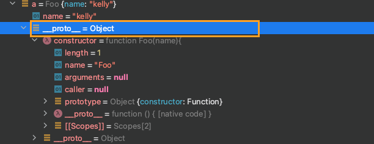
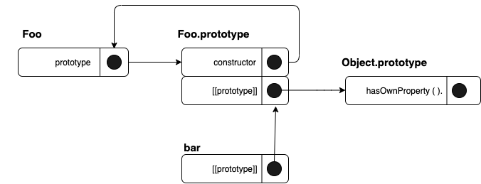
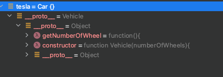
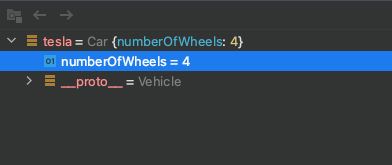
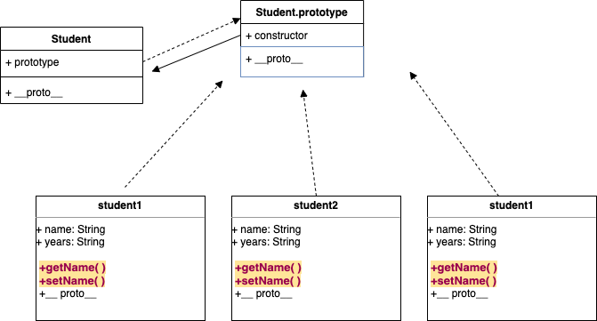
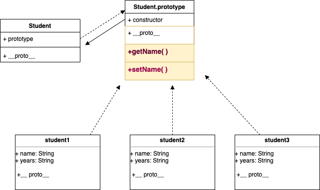

- 이 포스트는 카일심슨의 YOU DON'T KNOW JS, 정진욱님의 타입스크립트 퀵스타트를
  참고 하여 이해한 바탕으로 적은 노트입니다. 발전하는 개발자가 될 수 있도록 설명이 잘못 되었다거나
  조금 더 보충설명이 필요 하시다고 생각되시면 댓글 남겨 주세요. 언제든지 환영입니다 😄

## 자바스크립트가 말하는 상속 (ES6,ES5)

자바스크립트를 쓰면 쓸수록 왜 그렇지 ? 라고 생각하는 부분의 답에는 prototype이 자리를 지키고 서
있었다. 이 글에서 그런 부분을 나 스스로뿐만 아니라 읽는 분들에게도 도움이 되었으면
한다.

일단 OOP 상속 관계에 대한 theme을 말하자면, 상속은 상위/부모 클래스에 속해 있는 메서드와 속성 들을 물려 받는 새로운 child 클래스를 만들수가 있다. 여기서 말하는 부모 클래스는
superclass/base class로 불려지기도 하고 child클래스는 subclasses/derived classes로 불려지기도 한다. 상속관계는 클래스간의 **'kind-of'** or **'is-a'**
관계로 나타낼 수 있다. 예를 들어 "a dog is an animal" or "a dog is a kind of animal". 개는 동물이다, 개는 동물의 한 종류이다. 라는 관계가 성립한다.
**'HAS-A'** 라는 포함관계도 있는데 한 클래스에서 다른 클래스를 멤버변수로 선언하는 것이다. oop 기술인 상속은 자식클래스가 부모클래스에서 파생되고 부모의 모든 속성과 메서드를 이어받는다. **이렇게
이어받은 속성과 메서드는 자식클래스에서 다시 재정의 할 필요가 없다. 하지만 필요에 따라 자식클래스에서 메서드나 속성을 추가하기도 하고, 상속된 메서드의 내부 로직을 변경할 수도 있다.** ES06
자바스크립트에서도 class, extends를 사용하여 이런 상속적인 개념을 표현할 수 있다.

**1 . IS-A**

```javascript
class Bicycle {
  constructor() {
    this.numberOfWheel = 4 //<-private하게 하고 차일드가 가지고 올 순 없나?
  }
}

class MountainBike extends Bicycle {
  constructor() {
    super(numberOfWheel)
  }

  getNumOfWheel() {
    return this.numOfWheel
  }
}
```

**2 . HAS-A**

- 합성관계 (composition)-강한관계  
  engine 객체는 인스턴스화 될 때 생성되고 myCarr가 null이 되면 engine 객체도 제거된다.

```javascript
class Engine {}

class Car {
  #engine

  constructor() {
    this.#engine = new Engine()
  }
}

let myCar = new Car()
myCar = null
```

- 집합관계 (aggregation)- 약한관계 car객체가 생성될 때 외부에서 engine
  객체를 파라미터로 전달한다. car 객체가 null 이 되더라도 engine 객체는 사라지지
  않는다.

```javascript
class Engine {}

class car {
  #engine

  constructor(engine) {
    this.engine = engine
  }
}

let engine = new Engine()

let car = new Car(engine)
```

### ES06 상속 구현 하기

ES06 클래스에선 super와 this 키워드를 이용해 부모클래스의 선언된 멤버 메서드나 멤버
변수에 접근할 수 있습니다.

- super - 부모클래스의 public 멤버만 접근 가능.
- this - 상속받은 멤버와 현재클래스내의 모든 멤버 접근가능.

```javascript
class PC {
  #ram

  constructor(hddCapacity) {
    this.hddCapacity = hddCapacity
    this.#ram = '0GB'
  }

  set ramCapacity(value) {
    this.#ram = value
  }

  get ramCapacity() {
    return this.#ram
  }

  getHddCapacity() {
    return this.hddCapacity
  }
}

class Desktop extends PC {
  퍼
  constructor(hddCapacity) {
    super(hddCapacity)
  }

  getInfo() {
    console.log(
      `1. HDD capacity : ${super.getHddCapacity()},${super.hddCapacity}`,
    )

    console.log(
      `2. HDD capacity : ${this.getHddCapacity()},${this.hddCapacity}`,
    )

    this.hddCapacity = '2000G'
    console.log(
      `3. HDD capacity : ${super.getHddCapacity()},${super.hddCapacity}`,
    )
    console.log(
      `4. HDD capacity : ${this.getHddCapacity()},${this.hddCapacity}`,
    )

    super.ramCapacity = '16G'
    console.log(`5. RAM capacity : ${this.ramCapacity},${super.ramCapacity}`)

    this.ramCapacity = '8G'
    console.log(`6. RAM capacity : ${this.ramCapacity},${super.ramCapacity}`)
  }
}

let mydesktop = new Desktop('500G')
mydesktop.getInfo()

// 1. HDD capacity : 500G,undefined
// 2. HDD capacity : 500G,500G
// 3. HDD capacity : 2000G,undefined
// 4. HDD capacity : 2000G,2000G
// 5. RAM capacity : 16G,16G
// 6. RAM capacity : 8G,8G
```

확장된 클래스(Desktop)에서 상위 클래스의 멤버변수에 접근하기 위해선, 부모 클래스
생성자를 호출해줘야한다. 방법은 사용할 부모클래스의 멤버 변수를 확장된 클래스의 constructor
의 매개변수로 넘겨주고 super()에도 constructor 의 매개변수를 같이 넘겨준다.(super()
= 부모클래스의 생성자를 호출하는 함수)

```javascript
constructor(hddCapacity)
{
  super(hddCapacity)
}
```

1,3 번에서 super키워드로 부모의 public 멤버 변수에 접근하면 undefined를 return한다.
public 멤버 변수일지라도, super키워드로는 상위클래스의 멤버변수를 직접 호출해 가져올
수 없다. 하지만 this 는 직접 호출 가능 하다. 상위클래스의 private 멤버변수의 접근과
수정은 getter 와 setter로 가능하다.

#### **정리**

|                                    | super                                 | this                                  |
| ---------------------------------- | ------------------------------------- | ------------------------------------- |
| parent pubic 멤버 변수 직접 접근   | ❌ (getter/멤버 메서드로 접근)        | ✅                                    |
| parent pubic 멤버 함수 직접 접근   | ✅                                    | ✅                                    |
| parent private 멤버 변수 직접 접근 | ❌ ( 부모 클래스에 setter있으면 가능) | ❌ ( 부모 클래스에 setter있으면 가능) |

&nbsp;
&nbsp;

### Class 뒤의 [ [ prototype ] ] 체계

위에서 상속 개념을 설명하기 위해 자바스크립트의 class를 이용하였다. 여기서
사용된 class라는 키워드는 사실 `[[prototype]]` 체계에 기반을 두고 있다. You Don't
know Js 의 저자인 카일 심슨은 자바스크립트의 체계를 많은 개발자들이 클래스
디자인 패턴으로 실현하려는 욕구를 충족하기 위해 Syntatic sugar를 써가며
자바스크립트의 체계를 억지로 고친것에 불과하다고 말한다. 그 이유중 하나가 아마
이런 논리로 뒷받침 될 수 있을 것 같다. **클래스지향 언어에서 클래스의
인스턴스화는 클래스의 내부를 인스턴스로 복사**한다. 이런과정은 매 인스턴스마다
일어난다. 하지만 자바스크립트는 이런 복사과정이 없고, `[[prototype]]` 링크로
객체들을 연결한다. 그러니깐 클래스 지향 언어에서의 상속의 개념과 스크립트 언어의
동적 특성과 혼합되었다라고 볼 수 있으며 상속(inherit)보다는 위임(delegation)이란
말이 더 가깝다.

위에서 설명한 내용을 미루어볼 때, 자바스크립트에선 프로토타입 링크로 객체를 연결한다고 했고 class란 키워드는 전통적 클래스지향 언어와는 다르게
작동한다했으니, 이 말을 합치면 자바스크립트에서 말하는 클래스는 프로토타입 링크로 객체를 연결하는 방식으로 이해 할 수 있다.
그럼 여기서 드는 의문점은 new 키워드로 객체(인스턴스)를 생성하는 것은 자바스크립트나 클래스지향 언어에서나 똑같이
사용하는데 어떻게 내부 동작원리가 다른가이다.

```javascript
function Foo(name) {
  this.name = name
  console.log(this) //  Foo()-> global   / new Foo() -> Foo {name:'kelly'}
}
/*===============================*/
//new 를 사용하지 않으면, 그냥 함수호출
let b = Foo('kelly')
console.log(b) //undefined
console.log(b.name) //undefined

/*===============================*/
//new 사용하면 생성자 호출
let a = new Foo('kelly')

console.log(a.name) //kelly
console.log(a.__proto__) //Foo {}
console.log(a.prototype) //undefined <-- ‼️ 일반 객체에는 생성되지 않는다
```

new 키워드를 사용하여 함수를 호출한 것과 아닌것을 비교한것이다. new 를 사용하기 전까지
Foo( ) 는 일반함수이다. 그래서 this 또한 글로벌 객체를 가리키고 있다. 하지만 new
Foo( ) 로 호출하게 되면 Foo() 생성자 함수가 된다. 즉, new 키워드로 Foo()를 호출하면,
새로운 빈 객체가 만들어지고 이 객체(a)는 `[[prototype]]` 라는 내부 프로퍼티가 생기고,`[[prototype]]`
는 다른 객체를 참조하는 레퍼런스로 사용된다. 이렇게 생성된 객체는 해당 함수 this로
바인딩이 된다. 위에서 언급된 `[[prototype]]` 라는 내부 프로퍼티는 자바스크립트에서
모든 객체는 `[[prototype]]` 이라는 프로퍼티를 가진다 (Chrome/vsCode/WebStorm etc
에서는 ** proto **). 밑의 이미지를 참고하면 `[[prototype]]` 가 생성되었다.



&nbsp;
`[[prototype]]`이 어떤 역할을 하는지 좀 더 자세하게 살펴보자.

```javascript
function Foo(name, menu) {
  this.name = name
}

let bar = new Foo('kelly')

console.log(bar.hasOwnProperty('name')) //true

console.log(bar.__proto__ === Foo.prototype) // true
console.log(bar.constructor === Foo.prototype.constructor) // true
console.log(Foo.prototype.constructor === Foo)
console.log(bar.constructor === Foo)
```

생성된 객체(bar)의 name 프로퍼티 유무를 확인하는 `hasOwnProperty('name' )` 는 true를
반환했다. 일단 여기서 bar 객체의 `hasOwnProperty()` 메서드를 선언 한 적이 없음에도
불구하고 에러가 나지않고 함수가 동작하는 이유는 자바스크립트 엔진은 bar객체에 hasOwnProperty()
메서드가 없으면 이 객체의 `[[prootype]]` (내부 링크) 에 의해 연결 되어있는 객체를
따라가면서 프로퍼티를 찾을 때까지 유무를 확인한다. 이게 프로토타입 체이닝(Prototype
Chaining)이며 일련의 링크들을 프로토타입 연쇄(prototype chain)라고 한다. 그럼 이런
연쇄의 끝은 어디일까? hasOwnProperty메서드를 가지고있는 객체 `Object.prototype` 이다.
JavaScript에서 거의 모든 객체는 Object의 인스턴스이므로, Object.prototype 에서 속성과
메서드를 상속받는다. 다이어그램으로 나타내면 이런 연쇄가 나타난다.



객체 bar가 생성되면 내부적으로 `[[prototype]]` 프로퍼티는 Foo()함수의 `prototype `프로퍼티가
가리키는 객체를 참조하게 된다. **참고로 자바스크립트의 객체 생성 규칙인 함수 객체는
`length` 와 `prototype`이라는 프로퍼티를 기본적으로 가진다.** 그리고 함수객체 또한
객체이므로 `[[prototype]]` 프로퍼티도 포함한다.{' '}

이러한 생성규칙에 의해 `Foo.prototype`에 접근 할 수 있다. 그리고
`Foo.prototype` 또한 객체이므로 constructor 프로퍼티를 가지고 있다.
`.prototype` 레퍼런스를 가진 함수, 즉 위의 예제에서는 Foo() 함수를
가리킨다.

constructor에 대해 조금 더 알아보자. 위 코드를 조금 더 확장했다.

```javascript
function Foo(name, menu) {
  this.name = name
}

console.log(Foo.prototype.constructor == Foo) //true

let bar = new Foo('kelly')

console.log(bar.constructor === Foo) //true
```

클래스지향에서 그렇듯이 constructor는 new 키워드로 호출 되어 지고 인스턴스를 초기화한다고 알고있다.
위의 bar 객체도 Foo에 의해 생성되었으니, constructor가 클래스지향에서
생각하는 생성자라고 생각할 수 있지만, 카일심슨은 "생성자와 프로토타입이란 용어자체의
의미는 기본적으로 느슨하기 짝이 없어서 나중에는 부합하지 않을 가능성도 있다. 생성자는 '생성됨을 의미하지 않는다.'"
라고 말한다. 증명을 보겠다.
위의 코드에서 bar.constructor === Foo 가 true를 리턴하였으므로 Foo()가 bar를
생성한 것처럼 볼 수 있다.

```javascript
console.log(Foo.prototype.constructor == Foo) //true

Foo.prototype = {
  age: 20,
}

let bar = new Foo('kelly')
console.log(bar.constructor === Foo) //false
```

하지만, Foo.prototype 에 다른 객체를 정의 하는 순간, bar의 constructor 는 없어진다.
더이상 Foo가 아니다. 왜 그럴까?

constructor가 bar객체 내에 실제 존재하는 것이 아니라, Foo.prototype
객체에 위임하기 때문에, Foo.prototype 을 새로운 객체, 다른 프로퍼티들과 함께
바뀌면, constructor 프로퍼티가 당연히 없어지므로 bar 객체가 당연 접근할 수가 없다.
그러면 이런 논리에 의하면, bar.constructor가 실제 기본함수를 참조하는 레퍼런스라는
보장이 전혀 안되므로 불안정 할 뿐더러, 직접 사용하지 않는 것이 좋다고 한다.

## 두 객체간의 위임 링크 생성

```javascript
function Vehicle(numberOfWheels) {
  this.numberOfWheels = numberOfWheels
}

Vehicle.prototype.getNumberOfWheel = function () {
  return this.numberOfWheels
}

function Car(arg) {}

Car.prototype = Object.create(Vehicle.prototype)

const tesla = new Car(4)

console.log(tesla.getNumberOfWheel()) //undefined
console.log(tesla.constructor === Car.prototype) //false
```

이번코드는 위에서 언급했던 prototype에 새로운 객체를 할당했던 것과 비슷한
예제이다. 대신 object를 생성하는데 객체리터럴이 아닌 [ES05의 Object.create()](https://developer.mozilla.org/en-US/docs/Web/JavaScript/Reference/Global_Objects/Object/create)
를 사용하였다. Car.prototype은 새로운 객체 vehicle.prototype 을 연결한다. 어떻게? car.prototype 은 객체이므로,
** prototype ** 프로퍼티가 있을 것이고, 이 내부링크는 Object.create()의 매개변수인 vehicle.prototype 과 연결한다.
그럼 Car()에 의해 생성된 인스턴스 tesla는 Vehicle 객체의 getNumberOfWheel()메서드에
접근해도 되지 않을까? 접근을 하면 undefined를 리턴한다. 그 이유는 위에서 언급하였듯이
Car.prototype에 새로운 객체를 할당함으로써 `tesla`의 constructor는 더 이상 Car.prototype 과의 연결이 끊어져
Vehicle 객체의 멤버 변수나 메서드에 접근을 못한다. 이를 해결 할 수 있는 방법은 call 또는 apply를 사용한다.

```javascript
function Vehicle(numberOfWheels) {
  this.numberOfWheels = numberOfWheels
  this.engine = engine
}

Vehicle.prototype.getNumberOfWheel = function () {
  return this.numberOfWheels
}

function Car(arg) {
  Vehicle.call(this, arg)
}
Car.prototype = Object.create(Vehicle.prototype)

Car.prototype.identify = function () {
  console.log(`This car has ${this.getNumberOfWheel()} wheels.`)
}

const tesla = new Car(4)
console.log(tesla.getNumberOfWheel())
tesla.identify() //This car has 4 wheels.
```

call은 Vehicle 함수를 실행시켜 첫번째 인자인 this 그러니깐 Car의 인스턴스에 this를 바인딩한다.
tesla를 call하기전 과 후를 비교해보면,

- call() 하기 전

* call() 인한 바인딩
후{' '}



Car의 인스턴스인 tesla는 Vehicle 함수 객체의 변수나 메서드에 접근이 가능하며 이것은 마치 클래스
지향언어에서의 상속과 같은 양상을 띈다. 하지만 여기서 신경을 써줘야 할 점은 Car.prototype 에 새 객체를 할당한
후로 `Car.prototype.constructor`가 없어졌으므로, Car.prototype에 추가할 메서드나 변수가 있다면,
수동으로 해결해야 한다. ES06에선 Object.setPrototypeOf(), Object.getPrototypeOf() 을 사용하여
prototype 으로 prototype 객체들을 연결 할 수 있다. MDN의 prototype 설명에 따르면,
`__proto__` 은 deprecated 되었다고 나와있다. (Last modified: 2021년 6월 12일)

## prototype 효율성

함수객체의 prototype을 이용하여 상속을 구현할경우 공통적으로 사용되어지는 클래스
멤버에 대해 자원낭비를 줄일 수가 있는데 예를 들면 이렇다.

```javascript
function Student(name, years) {
  this.name = name
  this.years = years

  this.getName = function () {
    return this.name
  }

  this.setName = function (arg) {
    this.name = arg
  }
}

let student1 = new Student('sue', 'sophomore')
let student2 = new Student('kelly', 'sophomore')
let student3 = new Student('kyle', 'junior')

console.log(student1.getName()) //sue

console.dir(student1)
console.dir(student2)
console.dir(Student)
```

```javascript
function Student(name, years) {
  this.name = name
  this.years = years
}

Student.prototype.setName = function () {
  this.name = value
}

Student.prototype.getName = function () {
  return this.name
}

let student1 = new Student('sue', 'sophomore')
let student2 = new Student('kelly', 'sophomore')
let student3 = new Student('kyle', 'sophomore')

console.log(student1.getName()) //sue

console.dir(student1)
console.dir(student2)
console.dir(Student)
```

첫번째 코드베이스와 두번째 코드베이스의 차이점은 함수객체 내에 멤버 메서드를 선언할 때, this를 이용하여 함수객체 내에 선언하는가와 멤버 함수를 함수객체 scope 밖에 따로 Student.prototype 에
체이닝으로 접근하냐이다. 보여진 예시에서는 Student 객체함수의 인스턴스가 3개 뿐이지만 인스턴스가 1000개라면, 매 인스턴스 생성시, 각 인스턴스 마다 getName ,setName을 생성하게 된다. 어떤
인스턴스는 getName 과 setName 을 사용하지 않을 수도 있다. 이런 시나리오로 미루어 보아 불필요한 중복된 자원들이 메모리에 올라갈 것임을 알 수 있다. 이런 상황을 해결하는 방법이 prototype을
이용하는 것이고 두번째 코드가 예시이다. Student의 함수객체의 프로토타입 객체에 멤버 함수를 정의 하여 확장시킨다.(`Student.prototype.setName `)

<br />

<br />
👆this를 사용한 클래스 멤버 함수

<br />

<br />
👆 프로토타입 체이닝

위의 다이어그램에서 보여주듯이, Student 함수객체로 생성된 인스턴스들은 모두 Student.prototype을 가리키기 때문에 prototype 체이닝으로 Student.prototype의 멤버함수에 접근할 수
있다.

결국 Prototype 에서
자바스크립트에서의 상속의 개념은 클래스객체 지향 언어에서의 상속과는 다른 서로의 객체간의
체이닝이라고 볼 수 있으며, 그 이론에 대한 가장 기본적인 설명으론, new 로 생성자 함수를 호출할 때, 결국 객체와 객체를 연결한다는 것이다.
그래서 결국 자바스크립트 class도 프로토타입의 위임체계에 기반을 둔 일종의 간편구문이다.

---

참고자료

- [도서 - 카일 심슨, YOU DON'T KNOW JS, 한빛 미디어]
- [도서 - 송형주/고현준, 인사이드 자바스크립트, 한빛 미디어 ]
- [도서 - 정진욱, Quick start TypeScript, 루비페이]
- [MDN Prototype](https://developer.mozilla.org/ko/docs/Learn/JavaScript/Objects/Object_prototypes)
