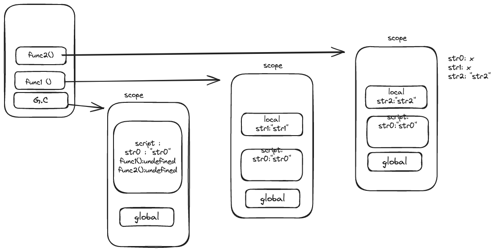
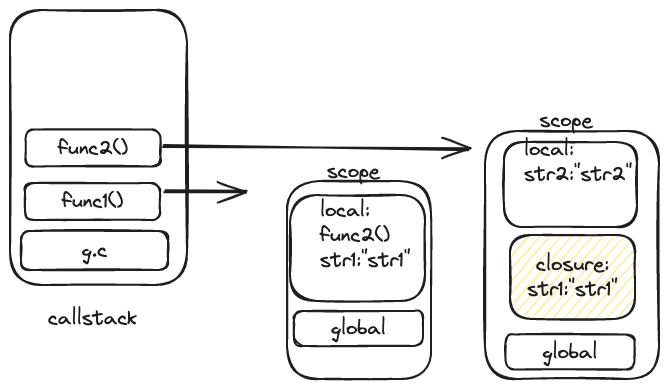
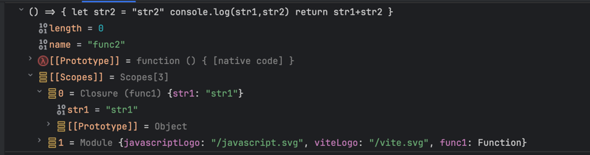
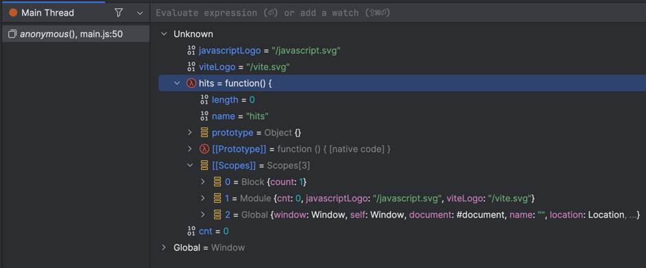
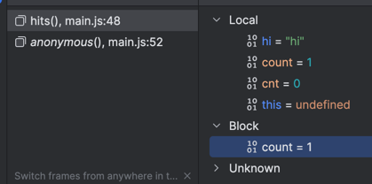

## 들어가면서 
이번 글은, closure에 대한 오해 경험과 알아가면서 생긴 궁금증들을 정리하는 글이다. 

## 클로저를 제대로 알지 못해 문제 정의를 잘못한 적이 있다.

오픈소스 코드에서 유저가 Drawer를 토글 하는 콜백 함수처리에서 상태가 변경되지 않는 경우가 있었는데, 이 원인을 클로저로 인해 상태값이
캡쳐링 되었다고 생각하여 문제 정의를 애초에 잘못한 적이 있었다. 

클로저에 대해 정확하게 알고 있었더라면, 문제 해결에 더 빨리 도달 했을 것이다.
이번 기회에 다시 코드가 execution context 에서 어떻게 동작 하는지를 이해해 보았다.

먼저 클로저 현상이 일어나지 않은 경우 이다. 

```javascript
let str0 = 'str0'


function func1(){
    let str1 = 'str1'
    console.log(str0, str1,str2 )
}

function func2(){
    let str2 = 'str2'
    console.log(str0, str1, str2)
}
console.log(str0, str1, str2)

func1()
func2()
```

아래 이미지는 크롬의 devtools의 실행 컨텍스트 기준으로 그려 보았다. (브라우저, IDE 마다 scope의 이름이 조금씩 다르다.)
이미지의 제일 왼쪽에에 있는 container가 콜스택이다. 함수가 호출 될 때 마다 콜스택에 쌓이고, 실행 컨텍스트가 생성된다.
각각의 실행 컨텍스트는 스코프를 가지는데, 이 스코프가 바로 변수를 참조할 수 있는 유효범위에 해당한다.



func1() 내에서 str0 를 참조할 수 있는 방법은
현재 실행되고 있는 함수의 유효 범위 내에 있는 str0을 찾는다.

유효 범위의 시작은 현재 보이는 scope 기준으로 local scope부터 시작하여
없으면 global scope로 올라가서 찾는다. 왜 local str1이 local scope에 저장되어 있는지 모른다면 let, var, const 의 유효범위에 대한 선행 지식이 필요하다.
script scope에 str0이 있기 때문에 str0을 찾을 수 있다.

하지만 `func1()`에서 `str2`값을 참조할 수 없다. 이유는 str2는 func1() 의 스코프에서는 찾을 수가 없다.  

그럼 코드를 변경해 보자. 

func2() 호출을 func1()내로 옮겨 본다.

```javascript
let str0 = 'str0'


function func1(){
    let str1 = 'str1'
    console.log(str0, str1,str2 )
    func2()
}

function func2(){
    let str2 = 'str2'
    console.log(str0, str1, str2)
}
console.log(str0, str1, str2)

func1()

```


func2()를 func1()에서 호출 했기 때문에 str1을 참조 할 수 있을 것 같지만, func2()라는 함수스코프를 가진 새로운 유효범위가 생성된 순간, func2()의
유효범위는 func1()의 유효범위와는 다르다. str1을 참조 할 수 없다.


이제 클로저인 경우를 살펴보자.

```javascript
export function func1() {
    const func2 = () => {
        let str2 = "str2"
        console.log(str1,str2)  //"str1str2"  
        return str1+str2
    }
    let str1 = "str1"
    console.dir(func2)
    // console.log(str1, str2) 
    func2()
}

func1()
```
scope에 closure가 새로 생성이 되었다. 즉 참조할 수 없었던 str1을 func2함수를 정의한 위치를 func1() 내로 변경하니 참조할 수 있게 되었다. 



다음은 인텔리제이에서 클로저를 디버깅한 화면이다. `console.dir(function2)` 에서 `[[Scopes]]` 내 closure로 str1을 참조 하고 있다. 





외부 함수 func1()의 실행 컨텍스트가 종료되어도 내부 함수 func2()의 실행 컨텍스트가 종료되지 않았기 때문에, func2()의 실행 컨텍스트는 여전히 살아 있고,


클로저의 개념 중에서 내부 함수가 실행할 때의 변수와 환경을 기억해서 독립적인 클로저를 갖게 된다는 말이 있는데,
특정시점의 값을 보존한다고 생각했다. 
내가 여태 오해한 클로저의 개념이었다.

캡쳐링 혹은 스냅샷의 의미로 잘못 이해 하여 값이 변경되지 않는다고 생각했었다. 

**하지만, 클로저는 라이브이다.** 

카일심슨의 You Don't Know JS 책의 예제를 인용해 보았다.


### DEBUGGER 에서 closure scope 가 없는 경우도 
카일 심슨 책을 보고 있던 중, 아래와 같은 예시가 있엇다. 
이건 클로저를 포함하고 있는가? 

```javascript
let hits;

{
    let count = 0;
    hits = function() {
        count++;
        console.log(count);
    }
}

hits(); // 1
hits(); // 2
hits(); // 3
```
함수 내에서 사용한 coun t변수는 함수 밖의 스코프에서 정의된 count를 참조 하고 있다. 
그런데 함수 밖의 스코프가 함수 스코프가 아닌 블럭 스코프이다. 
디버거에서 확인 해 보면 hits 함수의 스코프에는 closure가 없다.



그런데 이것도 클로저 라고 볼 수 있는가?

그렇다고 한다. 블로저의 외부 스코프는 일반적으로 함수에서 유래하지만, 반드시 함수스코프일 필요는 없다는 것이다.
내부 함수를 감싸는 외부 스코프(함수, 블록)가 있으면 클로저가 생성된다.

디버거에서 [[Scopes]] 에 Closure이 아닌 Block이 생성되었다. 
이것은 Block Scope를 가지는 let, const, class, function 등의 선언이 블록 스코프를 생성하기 때문이다.

클로저의 의해 외부 스코프인 Block Scope의 count 변수를 참조하고 있다.




