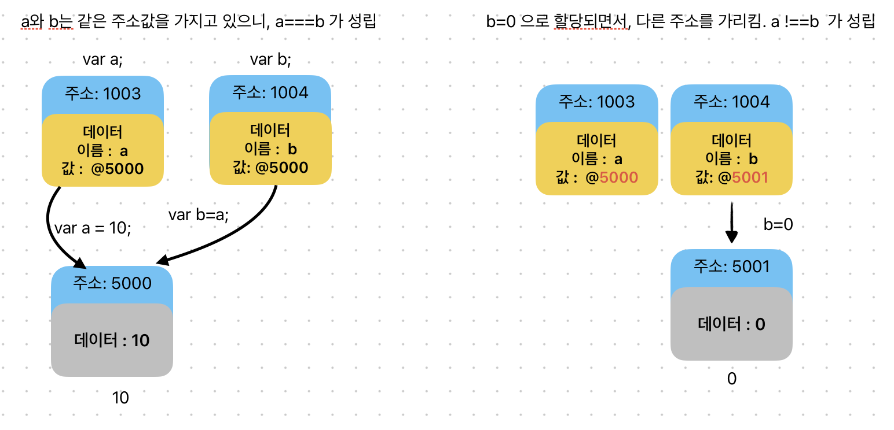

### 들어가며 

코어자바스크립트 책의 챕터 `1. 데이터 타입`을 읽고 난 후 이해한 점을 바탕으로 재구성하여 쓴 글이다.

이 챕터를 읽으면서 왜 기본형 데이터와 참조형 데이터를 알아야 하는 건지, 그리고 이 지식을 알았을 때 어떤 가치를 가져다 주는지를 계속 상기하면서 이해하려고 했다.
챕터를 읽고 난 후의 큰 결론을 이야기 하자면 결국 메모리 관리의 효율성을 위한 것이다. 

메모리를 효율적으로 쓴다는 것은 데이터 타입에서는 변수에 할당 된 데이터들을 매번 새로 생성 하지 않고 같은 값을 가지고 있는 데이터 영역(뒤에 설명될 것이다) 의 메모리에서 주소값을 참조 한다는 것이다.(재사용 가능)


그리고 기본형 데이터와 참조형데이터를 사용하는 과정에서 우리는 매 연산마다 이들이 어떻게 메모리에서 활용되고 있는지, 이 데이터들이 어떻게 변하는지 예측 할 수 있어야 한다고 생각한다.  그 이유는 이 둘은 데이터를 다루는 방식이 다른데  프로그래머로서 방식을 알고 있다면 작성하는 로직의 예측이 더 쉬워질 것이라고 예상한다. 

**객체는 가변적(mutable) 이라고 하는데, 내부 동작 원리가 어떻게 되는지? 그리고 "기본형 데이터가 불변(immutable)하다" 를 메모리 관점에서 설명할 수 있는지?** 에 대한 궁금증이 해소가 될 수 있을 것이다. 


#### 기본형 데이터의 불변성(immutability) 증명하기 

전제 : 기본형 데이터가 불변이지 기본형 데이터를 담은 변수가 불변인 것은 아니다.
- 기본형 데이터는 책에서 말하는 메모리를 데이터 영역과 변수 영역으로 구분 한 것에서, 데이터 영역의 메모리를 이야기 한다.
- 데이터 영역의 메모리란 주소인데 **기본형 데이터 값**을 가질 수 있는 주소로 이해 해도 될 것 같다.(아래 이미지의 회색&파란색 메모리주소 부분 참고)
- 변수 영역은 데이터가 담긴 데이터 영역의 메모리 주소가 할당된다. 

```javascript
var a = 10;
var b = a;

console.log(b) // 10
b = 0; 
console.log(b) // 0
console.log(a) // 10
```

- 불변을 설명하기 위해선 b라는 변수가 0으로 재할당 되었을 때, 데이터 영역의 5000번에서 데이터 값이 10->0 으로 변환하는걸 기대했을 수도 있겠지만, 
그렇게 되면 불변성이 아니다. 그 이유는 이미 10이라는 값을 가지고 있는 메모리에서 값을 변경 시키고 있기 때문이다(가변).
불변성을 유지하기 위해 0의 값을 가진 데이터 영역(라이트블루&그레이)에서 새로운 주소가 만들어 졌고, 변수b의 주소에서 0의 값을 가진 데이터영역의 5001번을 참조하는 것으로 변경되었다. 

- **데이터의 영역에 있는 주소의 데이터는 변경 되지 않는다. 새로 생성될 뿐, 이것이 불변성을 말하고 있는 것이다.** 그런데 이게 오직 데이터 영역에서 일어나고, 
데이터 영역은 기본형 데이터 타입으로만 저장 될 수 있으므로 결국 기본형 데이터는 불변이라고 볼 수 있다.
- 데이터를 담은 변수는 불변이 아니다. 변수는 변경될 수 있다. 아래 이미지처럼 식별자 b 를 가지고 있는 주소 1004의 값이 주소 5000 ->5001 로 변경됨으로써 변수가 불변이 되는 것은 아니다를 증명한다.





---

### 그럼 참조형 데이터는 가변일까? 기본형 데이터와는 어떻게 다른가?

여기서 중요한 점은 위에서 기본형은 불변이라고 했다면, 참조형 데이터는 가변적인 성질을 띄고 있는지, 기본형 데이터와는 어떻게 다른지 객체는 mutable 하다의 내부적 동작을 알아보았다.


```js
var obj = {
	 "c" : 0,
	 "d" : "10"	 
}

var anotherObj = obj;

anotherObj.d = 0

console.log(obj === anotherObj) // true ❗️anotherObj.d 를 변경하였음에도 불구하고 obj는 anotherObj와 일치한다. 왜일까? 
```

##### 참조형이 가변적 성질이 있음을 증명 
- 객체의 변수 영역이 존재한다는 점이다.(3000~). 그리고 그 변수의 값은 기존 만들어 두었던 데이터 0,10 을 그대로 활용하고 있다.
- 객체 내 프로퍼티들의 값은 기본형 값이므로 데이터 영역에 저장된 불변 값들이다. 하지만 객체는 메모리 변수 영역에 있으므로 anotherObj.d의 값의 변경 즉,
변수 3001 은 원래 5000주소를 참조하던 것에서 5001을 참조하는 것으로 바뀔 뿐 이걸 참조하는 주소값 2000을 anotherObj,obj는 결국 같은 값을 갖게 된다.
- 이게 참조형 데이터는 불변하지 않다 라고 볼 수 있다. 


위의 예제를 통해 객체 데이터 타입에서 가변성을 확인 할 수 있다. 한편으로 이러한 가변성은 문제점을 안고 오기도 한다. 
원본객체가 바뀌지 말아야 할 상황에서 문제가 생긴다.  

```js
// 객체 데이터 타입에서 가변성으로 인한 문제점
// 객체 데이터 타입은 가변성을 가지고 있기 때문에 문제가 발생할 수 있다.
var user = {
    name: "Sue",
    gender: "male",
  };
  
  const changeName = (user, newName) => {
    const newUser = user;
    newUser.name = newName;
    return newUser; // ❗️ 나름 새로운 객체를 만들어서 리턴한 노력 !  리턴했다고 생각할 수 있지만, 실제로는 user와 newUser가 같은 객체를 가리키고 있기 때문에 user의 값이 변경되는 것이다.
  };
  
  const user2 = changeName(user, "Sue2");
  if (user !== user2) {
    console.log("유저 정보가 변경되었습니다.");
  }
  console.log(user.name, user2.name); // ❗️Sue2 , Sue2
  console.log(user === user2);  //❗️ true
```

원본 객체가 바뀌지 말아야 할 상황이라 한다면 가령,  유저가 정보를 변경하는데  `changeName`함수를 통해 변경 하고 난 후의  미리보기 에서는 바뀐정보를, 일반 모드에서는 변경전 기존 유저 정보를 동시에 보여줘야 상황이라면,  

### 불변 객체가 필요하다.

그러니깐 복사본이 수정 되더라도 원본은 수정이 되면 안된다. 
위의 객체가 가진 가변성을 막기 위한 방법으로는 객체에 새로운 값을 할당 하는 것이다. 
**프로퍼티 변경 /할당이 아닌, 새로운 데이터 자체를 말한다**. 

```jsx
const changeName = (user, newName) => {
    const newUser = user;
    newUser.name = newName;
    return newUser; // ❗️ 나름 새로운 객체를 만들어서 리턴한 노력 !  리턴했다고 생각할 수 있지만, 실제로는 user와 newUser가 같은 객체를 가리키고 있기 때문에 user의 값이 변경되는 것이다.
  };
```

그런데 이 예제는 책에서도 언급했듯이,
"참조형 데이터가 가변값이라고 설명할 때의 가변은 참조형 데이터 자체를 변경하는 경우가 아니라 그 내부의 프로퍼티를 변경할 때만 성립합니다."
에 대한 반증이다. 

가변적인 참조형 데이터는 함수
프로퍼티만 변경 했기 때문에 참조형 데이터가 가변적이다라고 할 수 있다. 프로퍼티 변경이 아닌 새로운 값을 가진 객체를 리턴한다면 가변은 불변으로 만들 수 있다.

새로운 객체를 리턴하는 방법으로는,
- object literal 방식 
- object literal 방식이 번거로우니 모든 프로퍼티를 복사하는 함수
- Object.create()
- Object.assign()
- object spread operator

가 있을 수 있다. 
그런데 **이런 방식은 중첩된 객체에서 복사가 되지 않는다. 그 이유는 참조형 데이터가 저장된 프로퍼티를 복사할 때 주소값만 복사하기 때문이다**.
이를 **얕은 복사**라 한다. 해결방법으로는 깊은 복사 방법이 필요하다.


### 깊은 복사 구현 방법들

- 함수를 이용하여 내부 프로퍼티들을 일일이 순회한다. 만약 프로퍼티가 객체라면 그 객체의 프로퍼티들을 다시 순회하여 값들을 복사하는 방법.
- JSON.parse(JSON.stringify( object )) 이용
- (책에는 아직 기재되지 않은) WebAPIs 에서 제시한 structuredClone() .[MDN structuredClone 참고](https://developer.mozilla.org/en-US/docs/Web/API/structuredClone)
- Lodash’s cloneDeep()


### 정리하며 

불변성을 유지하기 위한 방법으로 쏙쏙 들어오는 함수형 프로그래밍이란 책에서는 카피-온-라이트와 방어적 복사를 소개 한다.
특히나 레거시 코드나 신뢰할 수 없는 코드로부터 불변성을 지키는 방법에 대해 설명하는데, 오늘 포스팅으로 객체에서 가변성의 원리를 알았으니 연장선으로 
좋은 배움이 될 것 같다.    


---
### 참고자료
- [코어자바스크립트](https://book.naver.com/bookdb/book_detail.nhn?bid=16405729)

