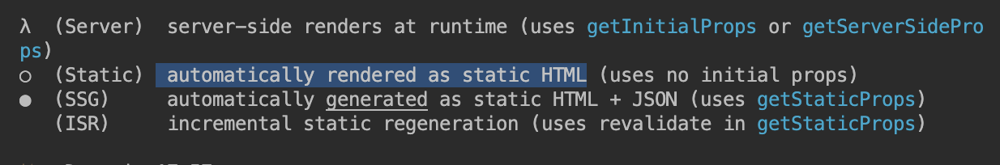

## 들어가며 

이 글은 Next.js에서 페이지 렌더링 방식을 이해하기 위해서 혼자 playground에서 실험 해보다 배우게 된 부분을 기록 하였습니다. 다소 글이 전문적 이지 않을 수도 있고 틀린 부분도 있습니다. 

---
## 넌 CSR이니 SSR이니 또는 SSG이니?

Next.js페이지에서 getServerSideProps getStaticProps 중 아무것도 지정하지 않은 상태에서 페이지 컴포넌트를 만들었습니다.

그리고는 현재 컴포넌트가 window 객체가 있다면 client 일 것이고, 없다면 server 에서 동작한다고 예상하여 log를 하나 남겼습니다.

useEffect를 통해 데이터를 불러와 csr동작임을 확인해 보기 위해 데이터도 렌더링 해보았습니다.

```javascript
export default function Test(){
    const [data,setData] = useState()
    console.log(typeof window==="undefined"?"serverrrr":"client")
    useEffect(() => {
        fetch('https://api.github.com/repos/vercel/next.js')
        .then(res => res.json())
        .then(data => setData(data?.description))
    },[])
    return <>
    <h1>Test Page</h1>
    <main>                                                              <h2>{data}</h2>
    </main>
    
    </>
}
```                                                                                                                                     
**`getServerSideProps`** 또는 **`getStaticProps`** 가 명시적으로 정의되지 않았음에도 불구하고, 서버와 클라이언트 양쪽에서 로그가 출력된 것을 관찰했습니다. 

이 현상은 Next.js의 기본 동작 원리와 관련이 있는데요.

**서버 사이드 렌더링 (SSR)**:

- 기본적으로, Next.js 페이지는 서버에서 렌더링됩니다. 페이지에 **`getServerSideProps`** 또는 **`getStaticProps`** 가 정의되어 있지 않더라도, 서버는 초기 HTML을 생성하고 클라이언트에 전송합니다.
- 이 과정에서 페이지의 JavaScript 코드는 서버에서 실행되며, 따라서 **`console.log`** 에서 "serverrrr"가 출력됩니다.

**클라이언트 사이드 렌더링 (CSR)**:

- 서버에서 생성된 HTML이 클라이언트(브라우저)에 도달하면, 페이지에 포함된 JavaScript가 클라이언트 측에서 실행됩니다.
- 이때, React 컴포넌트가 브라우저에서 다시 실행되고, **`console.log`** 에서 "client"가 출력됩니다.
- CSR에서 데이터 페칭은 클라이언트 측에서 이루어집니다. 여기서 **`useSWR`** 훅을 사용하여 데이터를 불러오는 부분이 CSR에 해당합니다.

### **왜 이런 일이 발생하는가?**

- **`OrderChangeListPage`** 컴포넌트는 서버에서 먼저 렌더링되고, 그 후에 클라이언트 측에서도 렌더링됩니다.
- 서버에서 렌더링될 때, **`typeof window === 'object'`** 는 **`false`** 가 됩니다. 왜냐하면 서버 환경에서는 **`window`** 객체가 존재하지 않기 때문입니다. 그래서 "serverrrr"가 출력됩니다.
- 클라이언트에서 렌더링될 때는 **`window`** 객체가 존재하므로 **`typeof window === 'object'`** 는 **`true`** 가 되고, "client"가 출력됩니다.

여태까지는 로컬에서 이루어진 일들입니다.

그럼 이 페이지를 빌드했을 땐 Next.js는 어떤 페이지로 받아 들일까요?

페이지에 **`getStaticProps`**, **`getServerSideProps`**, 또는 **`getInitialProps`** 가 명시적으로 정의되지 않은 경우, 페이지는 기본적으로 클라이언트 사이드에서 렌더링됩니다.빌드 시에는 간단한 HTML 틀만 생성되고, 실제 콘텐츠는 브라우저에서 JavaScript가 실행될 때 채워집니다. 이는 SSR이 아닌 CSR (Client-Side Rendering) 방식입니다.따라서 이 경우 페이지는 정적 페이지로 빌드되지 않으며, 전통적인 SSR 페이지로 빌드되는 것도 아닙니다. 대신, 페이지 로딩 이후에 필요한 데이터를 클라이언트 사이드에서 불러오는 CSR 방식이 적용됩니다.




- order-change페이지는 로컬시에 ServerSideRendering 방식처럼 행해 졌는데, 실제 빌드 후에는 Static 페이지가 되었고, 그렇다고 이페이지는 SSG 도 아니네요.

분명 Next.js에서 렌더링 방식을 설명할 땐 SSG, SSR, CSR이 었는데요. 저는 이해가 조금 어려웠습니다. 어떤 상황인지 설명이 잘 안되었기 때문이죠. 

데이터 페칭 함수를 사용하지 않는경우  페이지는 클라이언트 사이드 렌더링(CSR)으로 동작합니다.

- 빌드 과정에서 페이지에 대한 기본 HTML틀은 생성되지만, 페이지의 실제 콘텐츠는 브라우저에서 JavaScript가 실행 될 때 채워집니다.
- 그러므로 해당페이지는 클라이언트에서 전적으로 렌더링 된다고 볼 수 있습니다.
- 아래의 이미지는 빌드 과정에서 만들어진 HTML틀 입니다.
    


실제 페이지를 렌더링할 때 보여진 HTML과 , HTML이 브라우저로 전달 된 후 동적 페이지를 채우는 과정을 담은 영상은 아래와 같습니다.

- 페이지의 데이터는 브라우저에서 JavaScript가 실행되면서 API 호출 등을 통해 동적으로 불러오게 됩니다. 이것은 CSR의 전형적인 특징입니다.
- 이렇게 동적으로 불러온 데이터는 클라이언트 사이드에서만 사용되며, 빌드된 서버 사이드 파일에는 포함되지 않습니다.


- 빌드 폴더(**`.next`** 폴더) 내에서도 해당 페이지에 대한 파일을 찾을 수 있습니다. 하지만 이 파일은 주로 기본 HTML 틀과 페이지를 렌더링하는 데 필요한 JavaScript 코드를 포함하고 있습니다.

## 배운 점 :

결론적으로, **`getStaticProps`** 나 **`getServerSideProps`** 를 사용하지 않는 페이지는 빌드 폴더에는 존재하지만, 그 내용은 주로 기본적인 HTML과 클라이언트 사이드 렌더링을 위한 JavaScript 코드로 구성됩니다. 페이지의 실제 콘텐츠나 데이터는 클라이언트 사이드에서 동적으로 로드되고 렌더링되며, 빌드 파일 자체에는 포함되지 않습니다.

왜 Next.js가 서버사이드와 클라이언트 사이트의 이점을 모두 가질 수있다는 건지에 대해 조금 알게 되었습니다. 이런 동작방식은 서버사이드 렌더링의 초기 로딩 성능을 가져올 수 있고, 동시에 클라이언트 사이드에서의 동적인 인터랙티브한 기능을 결합하여 사용자에게 좀 나은 경험을 선사할 수 있을 것 같습니다. 중요한 건 이런 특정을 잘 이해하고 활용하는 것 입니다.


---

참고 

https://nextjs.org/ Nextjs 공식문서

